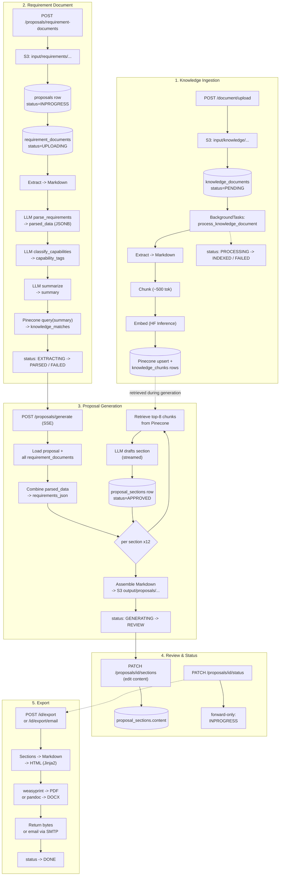

# System Workflow — Proposal AI Backend

## Purpose

This backend turns two kinds of uploaded documents — an organization's **knowledge base** and a client's **requirement/RFP document** — into a drafted, section-by-section **proposal**, which a human then edits and **exports** as PDF/DOCX or emails out. This skill is the map of that whole pipeline: five flows, what each stores, what each retrieves, and — critically — which parts of the code are actually wired up to run versus present-but-dead scaffolding.

Read the relevant `references/*.md` file for full file:line detail on any one flow. This file is the overview + the cross-cutting facts (storage map, enum table, dead-code list) that don't belong to any single flow.

## Mental model

## Read this first — live vs. dead code

The codebase contains a fair amount of built-but-unreachable scaffolding. Do not assume something works just because the function exists — check whether anything actually calls it. Known gaps as of this writing:

- **Arq/Redis background queue is fully wired but inert.** `tasks/arq_worker.py` registers `knowledge_document_job`, `requirement_document_job`, `proposal_generation_job`; `tasks/arq_pool.py::get_arq_pool()` always returns a `_NoOpArqPool` whose `enqueue_job` just logs and returns `None` (the real `arq.create_pool(...)` call is commented out). Nothing in the repo calls `enqueue_job`. In practice: knowledge-document processing runs via FastAPI `BackgroundTasks` (in-process, not a separate worker); requirement-document parsing and proposal generation both run **synchronously inside the HTTP request** (generation streams over SSE).
- **Section-level LLM quality-check + regenerate/approve are unreachable via the API.** `generation/nodes.py::run_quality_check`/`decide_section_status` and `services/proposal_review_service.py::regenerate_section`/`approve_section` are fully implemented, but the router endpoints that used to expose them (`POST /proposal_sections/{id}/regenerate`, `POST /sections/{id}/approve`) are not present in the current working tree. The live `/proposals/generate` stream never calls the quality-check path at all — every section is force-persisted as `APPROVED` with no gate. See `references/review-workflow.md`.
- **`Proposal.proposal_json`, `approved_markdown`, `is_approved`, `pdf_path` are always empty.** All four columns exist on the model and are returned in API responses, but no code path in the current tree ever writes them. The whole-proposal "approval" feature that used to populate `approved_markdown`/`is_approved` was deleted in commit `cffb589` (removal of the `APPROVED` status) and replaced by a simple forward-only `PATCH /proposals/{id}/status`.
- **`Proposal.category_ids` is read but never set** by any live code path, so the category filter on knowledge retrieval (`{"category_id": {"$in": category_ids}}`) is effectively always "no filter" today.
- **Export never persists to S3.** `S3PathBuilder.proposal_docx`/`proposal_pdf` key builders exist for exactly this purpose but are never called — rendered PDF/DOCX bytes are returned directly in the HTTP response or streamed into an email, then discarded.
- **`rendering/templates.py`** (`PROPOSAL_TEMPLATES`, per-template Pandoc `--reference-doc` DOCX styling + generated reference `.docx` files) is unused dead code. The live rendering path is `rendering/html_templates.py` → Jinja2 → weasyprint (PDF) / plain pandoc (DOCX, default styling only).
- **`generation/prompts.py`** (whole-document-in-one-call prompt) and **`generation/requirement_context.py::build_combined_summary`** are defined but never imported/called anywhere.
- **`extraction/ocr_extractor.py`** is a standalone dev script (module-level code, hardcoded path) — not used by the pipeline. The real OCR path is `extraction/ocr_engine.py::StructuredOCREngine` (PaddleOCR `PPStructureV3`).
- **`KnowledgeDocument.availability_status` (ACTIVE/INACTIVE) does not gate Pinecone retrieval** — it's not written into vector metadata and isn't checked at query time, so an `INACTIVE` document's chunks remain retrievable.

## The five flows

| # | Flow | Entry point | Detail |
|---|------|--------------|--------|
| 1 | Knowledge ingestion | `POST /document/upload` | [references/knowledge-flow.md](references/knowledge-flow.md) |
| 2 | Requirement document | `POST /proposals/requirement-documents` | [references/requirement-document-flow.md](references/requirement-document-flow.md) |
| 3 | Proposal generation | `POST /proposals/generate` (SSE) | [references/proposal-generation-flow.md](references/proposal-generation-flow.md) |
| 4 | Review & status | `PATCH /proposals/{id}/sections`, `PATCH /proposals/{id}/status` | [references/review-workflow.md](references/review-workflow.md) |
| 5 | Export | `POST /proposals/{id}/export`, `.../export/email` | [references/export-flow.md](references/export-flow.md) |

## Storage map

| System | What | Location | Key columns / pattern |
|---|---|---|---|
| Postgres | Knowledge doc metadata | `knowledge_documents` | `title`, `file_path` (S3 key), `status` (`IngestionStatus`), `extracted_markdown`, `tags`, `version` |
| Postgres | Knowledge chunks (source of truth mirroring Pinecone) | `knowledge_chunks` | `content` (breadcrumb-prefixed), `breadcrumb`, `pinecone_vector_id`, `page_number`, `token_count` |
| Pinecone | Chunk vectors | single index, default namespace (no namespaces used anywhere) | metadata: `document_id`, `category_id`, `breadcrumb`, `page_number`, `chunk_index`, `source_filename`, `text` |
| S3 | Original knowledge file | `input/knowledge/{user_id}/{category_id}/{doc_id_or_uuid}/{uuid}{ext}` | |
| Postgres | Requirement document | `requirement_documents` | `parsed_data` (JSONB), `capability_tags` (JSONB), `summary`, `knowledge_matches` (JSONB), `status` (`DocumentStatus`), `proposal_id` (FK) |
| S3 | Original requirement file | `input/requirements/{user_id}/{uuid_or_id}/{uuid}{ext}` | |
| Postgres | Proposal | `proposals` | `status` (`ProposalStatus`), `generation_mode`, `page_count`, `markdown_path` (S3 key), `category_ids` (unused), `proposal_json`/`approved_markdown`/`is_approved`/`pdf_path` (all unused, always empty) |
| Postgres | Proposal sections | `proposal_sections` | `section_key`, `title`, `order_index`, `content`, `citations` (JSONB), `status` (`ProposalSectionStatus`), `confidence_score`/`review_flag` (only set by the currently-unreachable regenerate path) |
| S3 | Assembled proposal markdown | `output/proposals/{user_id}/{proposal_id}/proposal.md` | written once, on successful generation |
| — | Exported PDF/DOCX | **not persisted** | rendered fresh from live `proposal_sections` on every export call; returned in the HTTP response or emailed, then discarded |

## Enum reference

| Enum | Values | Governs | Notes |
|---|---|---|---|
| `IngestionStatus` | `PENDING → PROCESSING → INDEXED` / `FAILED` | `KnowledgeDocument.status` | |
| `DocumentAvailability` | `ACTIVE`, `INACTIVE` | `KnowledgeDocument.availability_status` | Not enforced at Pinecone query time |
| `DocumentStatus` | `UPLOADING → EXTRACTING → PARSED` / `FAILED` | `RequirementDocument.status` | Separate enum namespace from the two below |
| `ProposalStatus` | `INPROGRESS → GENERATING → REVIEW → DONE`, or `FAILED` | `Proposal.status` | `APPROVED` existed briefly (added, then renamed to `DONE`, then re-added, then removed in `cffb589` — see review-workflow.md for the full history). Forward-only via `PATCH /status`; `FAILED` is exempt from ranking. |
| `ProposalSectionStatus` | `PENDING`, `DRAFTING`, `DRAFTED`, `NEEDS_REVISION`, `APPROVED` | `ProposalSection.status` | `DRAFTING`/`DRAFTED` are never actually assigned by any live code path |
| `GenerationMode` | `LLM_ONLY`, `KNOWLEDGE_AUGMENTED` | `Proposal.generation_mode` | Gates whether Pinecone retrieval runs at all during generation |

## Shared infrastructure quick index

| Concern | File(s) |
|---|---|
| Text extraction (shared by both document types) | `extraction/factory.py`, `extraction/pdf_extractor.py`, `extraction/docx_extractor.py`, `extraction/markdown_extractor.py`, `extraction/image_extractor.py`, `extraction/ocr_engine.py`, `extraction/heading_detector.py` |
| Chunking | `chunking/pipeline.py`, `chunking/markdown_splitter.py`, `chunking/recursive_splitter.py`, `chunking/tokenization.py` |
| Embedding | `embedding/embedder.py`, `embedding/hf_inference_client.py` |
| Vector store | `vectorstore/knowledge_store.py`, `vectorstore/pinecone_client.py`, `vectorstore/index_manager.py` |
| LLM client | `llm/chat_client.py` (`GroqChatClient`, GPT-OSS via Groq's OpenAI-compatible API) |
| S3 | `utilities/s3_service.py` |
| Email (SMTP) | `utilities/email_service.py` |
| Background task queue (currently inert, see above) | `tasks/arq_worker.py`, `tasks/arq_pool.py`, `tasks/document_processing.py`, `tasks/requirement_processing.py`, `tasks/proposal_generation.py` |
| DB models / enums | `database/models.py`, `database/db_enum.py` |
| CRUD | `database/crud.py` |
