# Backend Workflow Guide

How a request actually travels through this backend, end to end, for every major happy-path
flow — grounded in the real router/service/database code, not a generic description of how a
FastAPI backend "usually" works. Written for new developers, testers, BAs, and stakeholders who
need to understand the system without reading the whole codebase.

> Where something is only partially wired up, that's called out explicitly in a **Partial
> implementation** note. Nothing here is described as complete unless it actually is.

## Table of contents

1. [Overview](#overview)
2. [Architecture Overview](#architecture-overview)
3. [Overall Backend Request Lifecycle](#overall-backend-request-lifecycle)
4. Auth & Access
   - [User Registration](#user-registration)
   - [User Login](#user-login)
   - [JWT Authentication](#jwt-authentication-cross-cutting)
   - [Password Reset / OTP](#password-reset--otp)
5. Requirement Intake
   - [Requirement Upload](#requirement-upload)
   - [Text / PDF / Image Extraction](#text--pdf--image-extraction)
   - [Requirement Parsing](#requirement-parsing)
   - [Capability Tagging](#capability-tagging)
6. Knowledge Base
   - [Knowledge Repository CRUD](#knowledge-repository-crud)
   - [Knowledge Document Ingestion](#knowledge-document-ingestion)
   - [Document Chunking](#document-chunking)
   - [Embedding Generation](#embedding-generation)
   - [Pinecone Storage](#pinecone-storage)
   - [Vector Retrieval](#vector-retrieval)
7. Proposal Lifecycle
   - [Proposal Generation](#proposal-generation)
   - [LangGraph Workflow](#langgraph-workflow)
   - [Proposal Review](#proposal-review)
   - [Proposal Export](#proposal-export)
   - [Proposal History](#proposal-history)
8. Administration
   - [Administration APIs](#administration-apis)

---

## Overview

Proposal AI turns an RFP into a drafted proposal. Users upload knowledge-base documents (case
studies, capability statements) and requirement documents (RFPs); the system extracts and chunks
the former into Pinecone, parses the latter into structured requirements via an LLM, drafts a
proposal section-by-section, and lets a human review, edit, and export it.

Each workflow below follows the same shape: a plain-language summary, a numbered step-by-step
trace through the actual code, an ASCII diagram, a Mermaid diagram, the modules involved, and the
final response.

---

## Architecture Overview

Each top-level package has one job. A request typically passes through several of these in
sequence.

| Folder | Responsibility |
|---|---|
| `router/` | FastAPI route handlers — the HTTP boundary. Parses the request, calls a service, shapes the response. Contains no business logic of its own beyond orchestration. |
| `authentication/` | JWT minting/verification (`jwt_handler.py`), password hashing and the `get_current_user`/`require_role` FastAPI dependencies (`dependency.py`), and the auth business logic (`auth_service.py`). |
| `schemas/` | Pydantic request/response models — the API's typed contract, independent of the database models. |
| `database/` | SQLAlchemy models (`models.py`), the async engine/session setup (`database.py`), all CRUD query functions (`crud.py`), and status/role enums (`db_enum.py`). |
| `services/` | Cross-cutting business logic that's more than a single CRUD call — proposal review/export/naming, team management, organization settings, citation resolution. |
| `extraction/` | Per-format document extractors (PDF, DOCX, image, Markdown) that all converge on one normalized `ExtractedDocument` shape, plus the shared OCR engine. |
| `chunking/` | Splits extracted Markdown into retrieval-sized pieces — heading-aware, token-bounded, table-aware. |
| `embedding/` | Wraps the Hugging Face Inference feature-extraction endpoint used to turn text into vectors. |
| `vectorstore/` | The Pinecone client, index management, and upsert/query/delete operations against the vector index. |
| `requirements_parsing/` | LLM-driven structured extraction of an RFP into `RequirementsSchema`, plus capability classification and summary generation. |
| `prompts/` | The actual prompt templates consumed by `generation/` and `requirements_parsing/` — one module per LLM task. |
| `generation/` | The LangGraph proposal-generation pipeline — graph/nodes/state, plus length-budgeting and Markdown assembly helpers. |
| `rendering/` | Jinja2 templates and the HTML→PDF (WeasyPrint) / HTML→DOCX (Pandoc) renderers used by export. |
| `tasks/` | Background processing entry points for document/requirement ingestion. Runs via FastAPI `BackgroundTasks` today — the Arq queue scaffolding in this folder is not wired up. |
| `utilities/` | S3 access, email sending/transport, logging, pagination, and small stateless helpers (password generation, filename sanitizing). |
| `middleware/` | CORS and the global error-handling middleware that maps unexpected exceptions to consistent JSON responses. |

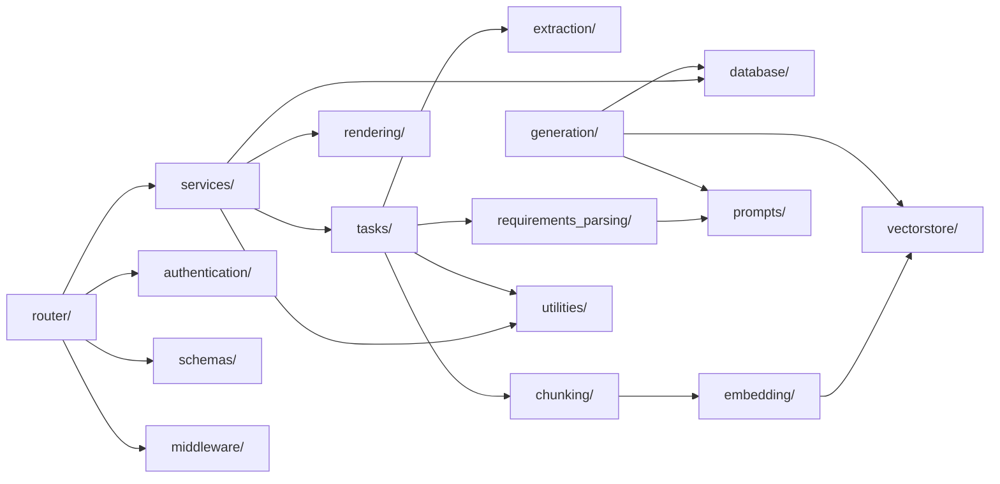
```mermaid
graph LR
  router[router/] --> services[services/]
  router --> authn[authentication/]
  router --> schemas[schemas/]
  services --> database[database/]
  services --> tasks[tasks/]
  tasks --> extraction[extraction/]
  tasks --> chunking[chunking/]
  chunking --> embedding[embedding/]
  embedding --> vectorstore[vectorstore/]
  tasks --> requirements_parsing[requirements_parsing/]
  requirements_parsing --> prompts[prompts/]
  generation[generation/] --> prompts
  generation --> vectorstore
  generation --> database
  services --> rendering[rendering/]
  router --> middleware[middleware/]
  services --> utilities[utilities/]
  tasks --> utilities
```

---

## Overall Backend Request Lifecycle

Every authenticated endpoint in this backend follows the same shape. This is the generic
skeleton every workflow below is a specific instance of.

```
Client
    │
    ▼
FastAPI Router            (router/*.py — parses the request, declares response_model)
    │
    ▼
Authentication             (Depends(get_current_user) / Depends(require_role(...)))
    │
    ▼
Request Validation         (Pydantic schema — schemas/*.py)
    │
    ▼
Service / Business Logic   (services/*.py, or inline in the router for simple CRUD)
    │
    ▼
Database / S3 / Pinecone / LLM   (database/crud.py, utilities/s3_service.py,
                                   vectorstore/, llm/chat_client.py)
    │
    ▼
Response Model              (schemas/*.py — shapes what the client actually sees)
    │
    ▼
Client
```

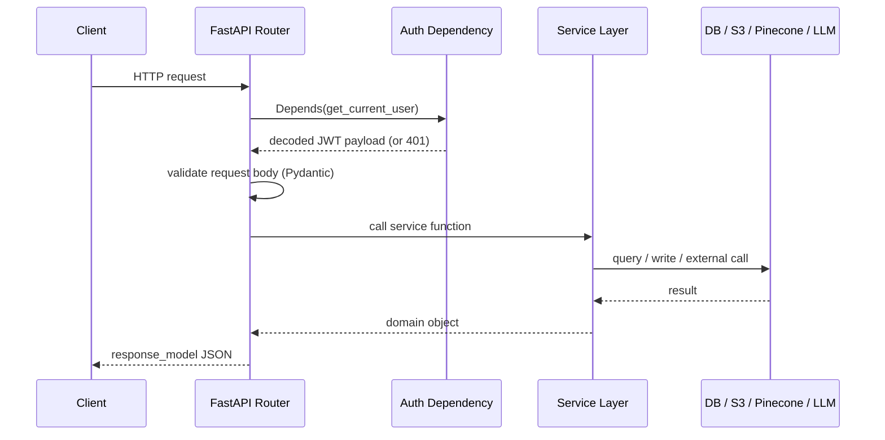
```mermaid
sequenceDiagram
  participant C as Client
  participant R as FastAPI Router
  participant A as Auth Dependency
  participant S as Service Layer
  participant D as DB / S3 / Pinecone / LLM
  C->>R: HTTP request
  R->>A: Depends(get_current_user)
  A-->>R: decoded JWT payload (or 401)
  R->>R: validate request body (Pydantic)
  R->>S: call service function
  S->>D: query / write / external call
  D-->>S: result
  S-->>R: domain object
  R-->>C: response_model JSON
```

1. **FastAPI Router** — every route is declared with a `response_model`, so the response shape is
   enforced automatically; FastAPI 422s on a malformed request body before any handler code runs.
2. **Authentication** — `Depends(get_current_user)` verifies the JWT's signature, issuer, and
   `token_type` claim (`authentication/dependency.py`); `Depends(require_role(...))` layers a
   role check on top for admin-only endpoints.
3. **Validation** — Pydantic models in `schemas/` reject malformed input before it reaches
   business logic.
4. **Service layer** — either a dedicated function in `services/`, or (for simpler CRUD) logic
   inline in the router itself calling `database/crud.py` directly.
5. **External systems** — Postgres (via the async SQLAlchemy session), S3 (file storage),
   Pinecone (vectors), and Groq/Hugging Face (LLM/embeddings) are the only things a request ever
   talks to outside the process.
6. **Response** — always shaped by an explicit Pydantic response model — the client never sees a
   raw ORM object.

---

## User Registration

> **Partial implementation** — see the note at the end of this section.

**Purpose:** Let a new user create an account with a self-declared role.
**Entry endpoint:** `POST /auth/register` (`router/auth_router.py:40-45`)

**Step by step**
1. Request body validated against `RegisterRequest` (`email`, `password`, `role`) — `schemas/auth.py`.
2. `register()` (`authentication/auth_service.py:78-93`) checks for an existing user with that email — `409` if found.
3. Password hashed with bcrypt (`authentication/dependency.py::hash_password`).
4. Role is passed through `utilities/generic.py::assign_role(is_organization_admin: bool)`.
5. New `User` row created (`database/crud.py::create_user`), `is_first_login=True`.
6. `RegisterResponse` returned: a confirmation message + email.

```
Client submits email/password/role
        │
        ▼
Validate request (RegisterRequest)
        │
        ▼
Check email not already registered ──▶ 409 if taken
        │
        ▼
Hash password (bcrypt)
        │
        ▼
assign_role(role)
        │
        ▼
Create User row (is_first_login=True)
        │
        ▼
Return RegisterResponse
```

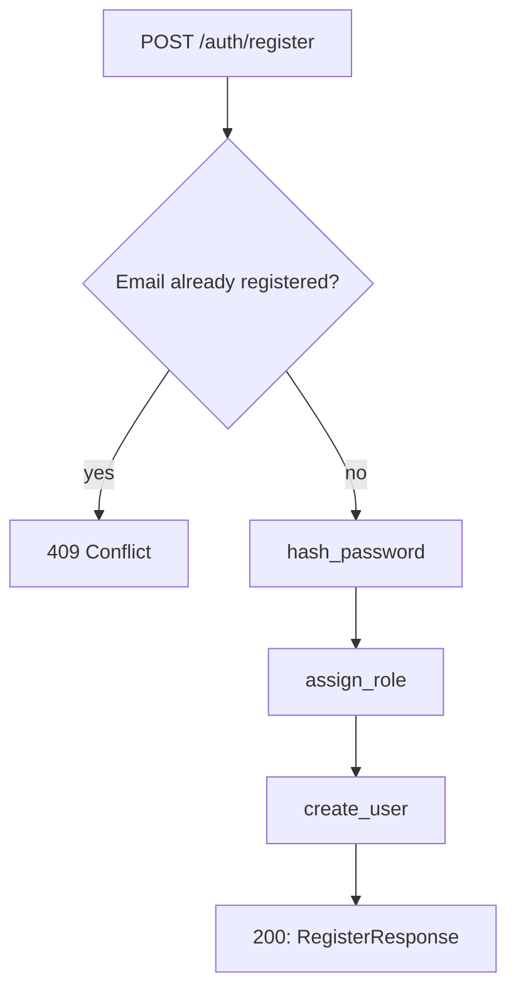
```mermaid
graph TD
  A[POST /auth/register] --> B{Email already registered?}
  B -- yes --> C[409 Conflict]
  B -- no --> D[hash_password]
  D --> E[assign_role]
  E --> F[create_user]
  F --> G[200: RegisterResponse]
```

**Components:** `router/auth_router.py` → `authentication/auth_service.py` → `authentication/dependency.py` (hashing) → `utilities/generic.py` (role assignment) → `database/crud.py` → `database/models.py::User`.
**Failure points:** duplicate email (`409`); malformed request body (`422`).

> **Partial implementation — verified against the test suite.** `assign_role()` expects a `bool`
> but is handed the request's `role` field (a `UserRole` enum). Since `UserRole` subclasses `str`
> and both member values are non-empty strings, both are truthy — so **every self-registered
> account is created as `org_admin`**, regardless of the role requested. This is a known,
> currently unresolved issue, already pinned by an `xfail(strict=True)` test in
> `test/test_auth.py:42-57`.

---

## User Login

**Purpose:** Exchange valid credentials for a JWT access/refresh token pair.
**Entry endpoint:** `POST /auth/login` (`router/auth_router.py:48-53`)

**Step by step**
1. Request validated against `LoginRequest` (`email`, `password`).
2. `login()` (`authentication/auth_service.py:49-75`) looks up the user by email; `401` if not found or password mismatch (`verify_password`, bcrypt).
3. `403` if the account is inactive (`user.is_active == False`).
4. `create_access_token` and `create_refresh_token` (`authentication/jwt_handler.py`) mint two signed JWTs.
5. `LoginResponse` returned: `access_token`, `refresh_token`, `role`.

```
Client submits email/password
        │
        ▼
Look up user by email ──▶ 401 if not found
        │
        ▼
verify_password (bcrypt) ──▶ 401 if mismatch
        │
        ▼
Check is_active ──▶ 403 if inactive
        │
        ▼
create_access_token + create_refresh_token
        │
        ▼
Return LoginResponse {access_token, refresh_token, role}
```

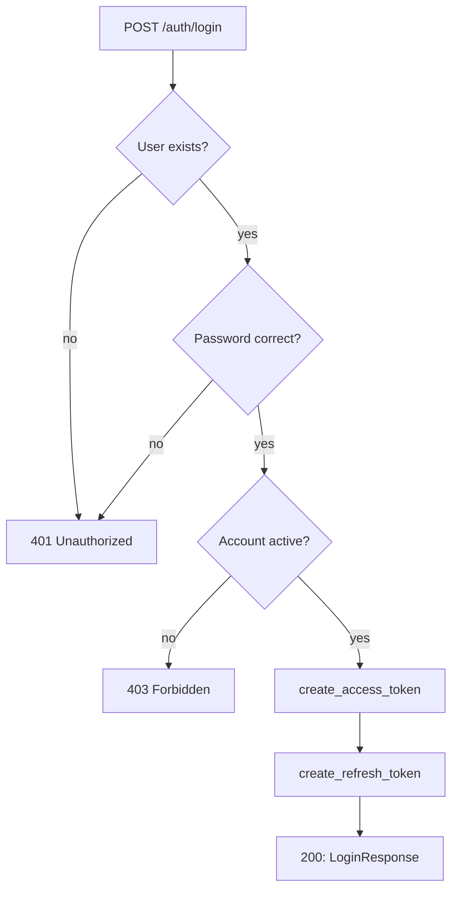
```mermaid
graph TD
  A[POST /auth/login] --> B{User exists?}
  B -- no --> C[401 Unauthorized]
  B -- yes --> D{Password correct?}
  D -- no --> C
  D -- yes --> E{Account active?}
  E -- no --> F[403 Forbidden]
  E -- yes --> G[create_access_token]
  G --> H[create_refresh_token]
  H --> I[200: LoginResponse]
```

**Components:** `router/auth_router.py` → `authentication/auth_service.py` → `authentication/dependency.py` (password verify) → `authentication/jwt_handler.py` (token mint) → `database/crud.py::get_user_by_email`.
**Failure points:** wrong credentials (`401`); inactive account (`403`).
**Note:** a `refresh_token` is returned, but there is no `/auth/refresh` endpoint to redeem it — it's issued but currently unusable by the client.

---

## JWT Authentication (cross-cutting)

**Purpose:** Verify identity and authorize access on every protected request, without a database lookup on the hot path.
**Entry point:** not a single endpoint — a FastAPI dependency, `Depends(get_current_user)`, attached to nearly every route across every router.

**Step by step**
1. `HTTPBearer` extracts the bearer token from the `Authorization` header.
2. `get_current_user` (`authentication/dependency.py:25-33`) calls `verify_access_token`.
3. `verify_access_token` (`authentication/jwt_handler.py:62-69`) decodes the JWT (HS256), checks the signature, the issuer (`iss`), and that `token_type == "access"` — rejects a refresh or password-reset token used here.
4. Decoded payload (`user_id`, `email`, `role`) is returned and injected into the route handler.
5. For admin-only routes, `require_role(UserRole.ADMIN)` (`dependency.py:35-53`) wraps this and additionally checks `payload["role"]` against the allowed set — `403` if it doesn't match.

```
Incoming request with Authorization: Bearer <token>
        │
        ▼
HTTPBearer extracts token
        │
        ▼
verify_access_token (signature, issuer, token_type=="access")
        │
        ├─ invalid/expired ──▶ 401
        │
        ▼
Payload injected as current_user
        │
        ▼
(admin routes only) require_role checks payload["role"] ──▶ 403 if not allowed
        │
        ▼
Route handler executes
```

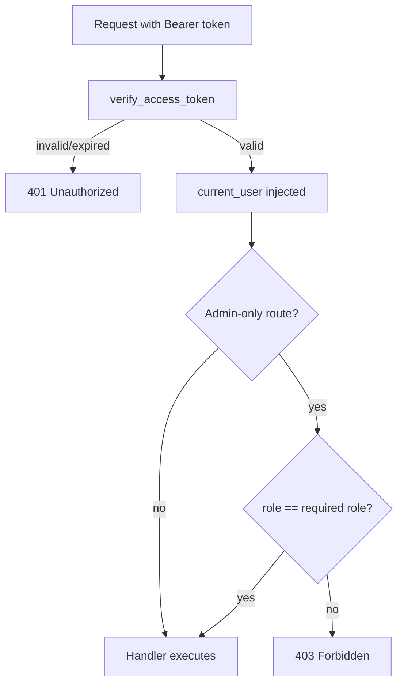
```mermaid
graph TD
  A[Request with Bearer token] --> B[verify_access_token]
  B -- invalid/expired --> C[401 Unauthorized]
  B -- valid --> D[current_user injected]
  D --> E{Admin-only route?}
  E -- no --> F[Handler executes]
  E -- yes --> G{role == required role?}
  G -- no --> H[403 Forbidden]
  G -- yes --> F
```

**Components:** `authentication/dependency.py`, `authentication/jwt_handler.py`. No database call is made to authenticate a request — everything needed is in the signed token itself.
**Failure points:** expired/forged/wrong-issuer token (`401`); wrong role on an admin route (`403`).
**Note:** stateless by design — there is no logout/token-revocation mechanism. A token remains valid until it expires (60 minutes by default), with no server-side way to invalidate it early.

---

## Password Reset / OTP

**Purpose:** Let a user who forgot their password regain access via an emailed one-time code, without ever exposing whether a given email is registered.
**Entry endpoints:** `POST /auth/forgot_password` → `POST /auth/verify_otp` → `POST /auth/new_password` (`router/auth_router.py:56-77`)

**Step by step**
1. **Forgot password** (`auth_service.py:119-140`): looks up the user; if found and active, generates a 6-digit numeric OTP (`utilities/generic.py::generate_otp`, CSPRNG via `secrets`), hashes it, stores it with a 10-minute expiry, and emails it. **Always** returns the same generic message regardless of whether the email exists — an email-send failure is caught and logged, never propagated, so the response can't be used to enumerate registered addresses.
2. **Verify OTP** (`auth_service.py:159-171`): checks the OTP against the stored hash and expiry (`_check_otp`) — `400` on any mismatch or expiry. On success, the OTP is cleared (single-use) and a short-lived `password_reset` JWT is issued.
3. **New password** (`auth_service.py:174-193`): redeems the reset token (`verify_password_reset_token`), looks up the user, and updates the password hash.

```
POST /auth/forgot_password
        │
        ▼
Look up user (never reveals if found)
        │
        ▼
Generate OTP, hash it, store with 10-min expiry
        │
        ▼
Email OTP (failure swallowed, logged only)
        │
        ▼
Always return generic "OTP sent if registered" message

POST /auth/verify_otp
        │
        ▼
Check OTP hash + expiry ──▶ 400 if invalid/expired
        │
        ▼
Clear OTP (single-use) + issue password_reset JWT

POST /auth/new_password
        │
        ▼
Verify password_reset JWT ──▶ 401 if invalid/expired
        │
        ▼
Update password hash
```

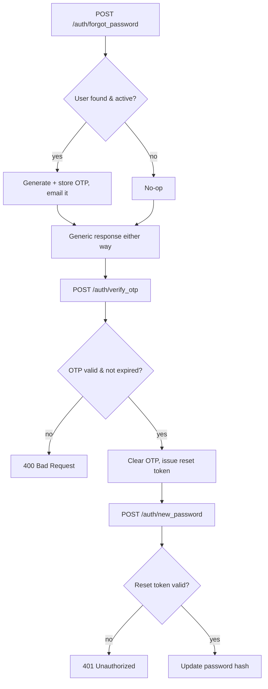
```mermaid
graph TD
  A[POST /auth/forgot_password] --> B{User found & active?}
  B -- yes --> C[Generate + store OTP, email it]
  B -- no --> D[No-op]
  C --> E[Generic response either way]
  D --> E
  E --> F[POST /auth/verify_otp]
  F --> G{OTP valid & not expired?}
  G -- no --> H[400 Bad Request]
  G -- yes --> I[Clear OTP, issue reset token]
  I --> J[POST /auth/new_password]
  J --> K{Reset token valid?}
  K -- no --> L[401 Unauthorized]
  K -- yes --> M[Update password hash]
```

**Components:** `router/auth_router.py` → `authentication/auth_service.py` → `utilities/generic.py` (OTP generation) → `utilities/email_service.py` / `email_transport.py` → `authentication/jwt_handler.py` (reset token) → `database/crud.py`.
**Failure points:** invalid/expired OTP (`400`); invalid/expired reset token (`401`); email provider failure (logged, swallowed — never surfaced to the caller).

---

## Requirement Upload

**Purpose:** Take an uploaded RFP/requirement document and turn it into structured, LLM-usable requirements — synchronously, in one request.
**Entry endpoint:** `POST /proposal/requirement-documents` (`router/proposals.py:161-233`)

**Step by step**
1. Accepts one or more files (multipart), `client_name` (required), optional `proposal_id`/`proposal_name`/`additional_context`. Empty file parts are filtered out — `422` if nothing valid remains.
2. File uploaded to S3 (`S3PathBuilder.requirement_document` + `S3Service.upload_file`) — `502` on failure. No DB row is created unless the upload succeeds.
3. A `Proposal` row is created (or reused, if `proposal_id` was given) — proposal identity begins here, not at a separate "create proposal" step.
4. A `RequirementDocument` row is created, `status=UPLOADING`.
5. `process_requirement_document_pipeline` (`tasks/requirement_processing.py:31-92`) is awaited synchronously — see [Requirement Parsing](#requirement-parsing) for what happens inside.
6. If the pipeline lands in `FAILED`, the endpoint raises `422`. Otherwise the document + parent proposal fields are returned.

```
User uploads document(s)
        │
        ▼
Validate request (at least one real file)
        │
        ▼
Upload to S3 ──▶ 502 on failure, no row created
        │
        ▼
Create/reuse Proposal row
        │
        ▼
Create RequirementDocument row (status=UPLOADING)
        │
        ▼
process_requirement_document_pipeline (synchronous)
        │
        ├─ FAILED ──▶ 422
        │
        ▼
Return RequirementDocumentResponse (201)
```

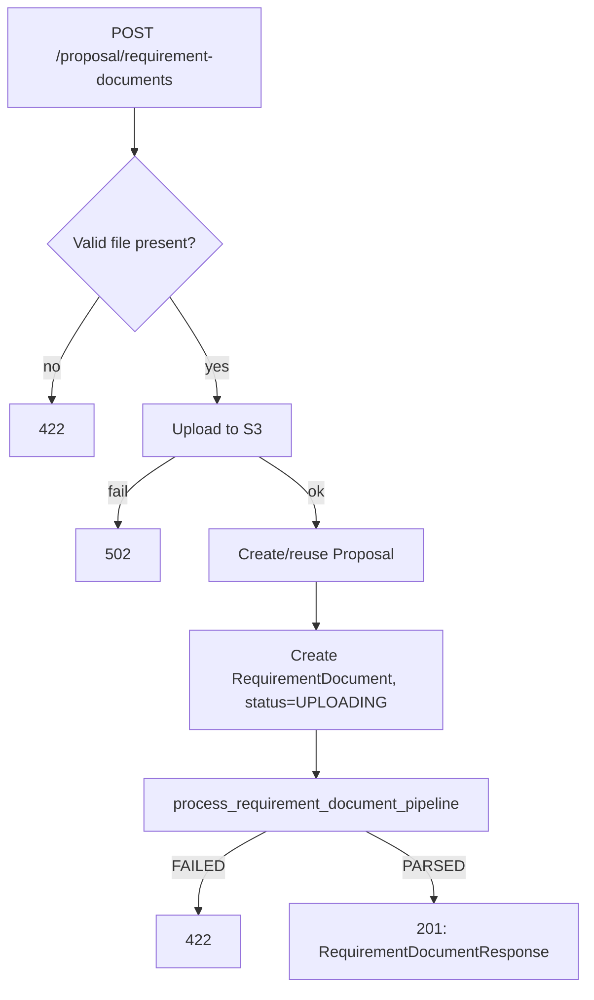
```mermaid
graph TD
  A[POST /proposal/requirement-documents] --> B{Valid file present?}
  B -- no --> C[422]
  B -- yes --> D[Upload to S3]
  D -- fail --> E[502]
  D -- ok --> F[Create/reuse Proposal]
  F --> G[Create RequirementDocument, status=UPLOADING]
  G --> H[process_requirement_document_pipeline]
  H -- FAILED --> I[422]
  H -- PARSED --> J[201: RequirementDocumentResponse]
```

**Components:** `router/proposals.py` → `utilities/s3_service.py` → `database/crud.py` → `tasks/requirement_processing.py`.
**Failure points:** no valid file (`422`); S3 upload failure (`502`); pipeline failure (`422`, document status `FAILED`, no retry path).

> **Partial implementation.** This runs entirely synchronously in the request. The Arq
> background-queue scaffolding (`tasks/arq_worker.py`, and a standalone
> `process_requirement_document` entry point) exists but is not wired up — `get_arq_pool()` is a
> no-op. Large documents or slow LLM responses are a real latency/timeout exposure on this
> endpoint today.

---

## Text / PDF / Image Extraction

**Purpose:** Convert any supported file format into one normalized Markdown representation, used identically by both the requirement and knowledge-document pipelines.
**Entry point:** `extraction/factory.py::run_extraction(file_path, source_filename, extension)` — not an HTTP endpoint; called by both ingestion pipelines after their file is downloaded from S3.

| Extension | Extractor | Mechanism |
|---|---|---|
| `.pdf` | `PDFExtractor` | PyMuPDF per-page. A page is routed to OCR if its native text layer is under 40 characters, or images cover more than 60% of the page. Otherwise: text layer + heading detection + Markdown table detection, re-sorted into reading order. |
| `.docx` | `DocxExtractor` | python-docx, walking the document body in original order (paragraphs + tables interleaved). Headings detected via named Word styles first, then by bold/underline/size ratio as a fallback. |
| `.png` / `.jpg` / `.jpeg` | `ImageExtractor` | Always routed straight to OCR — no native text layer to consider. |
| `.md` | `MarkdownExtractor` | Read through unchanged — it's already the target format. |

**OCR path (PDF scanned pages + all images):** `extraction/ocr_engine.py::StructuredOCREngine` — a
lazily-initialized singleton wrapping PaddleOCR's `PPStructureV3` (layout-aware OCR that
preserves paragraph/table structure and returns Markdown directly).

```
run_extraction(file_path, filename, extension)
        │
        ▼
get_extractor(extension)  ──  pdf | docx | png/jpg/jpeg | md
        │
        ▼
[PDF] per page: native text (+ heading/table detection)  OR  OCR fallback
[DOCX] walk body in order, map styles → Markdown headings, render tables
[Image] StructuredOCREngine.image_to_markdown (PPStructureV3)
[Markdown] read as-is
        │
        ▼
Return ExtractedDocument { markdown, source_filename, pages[] }
```

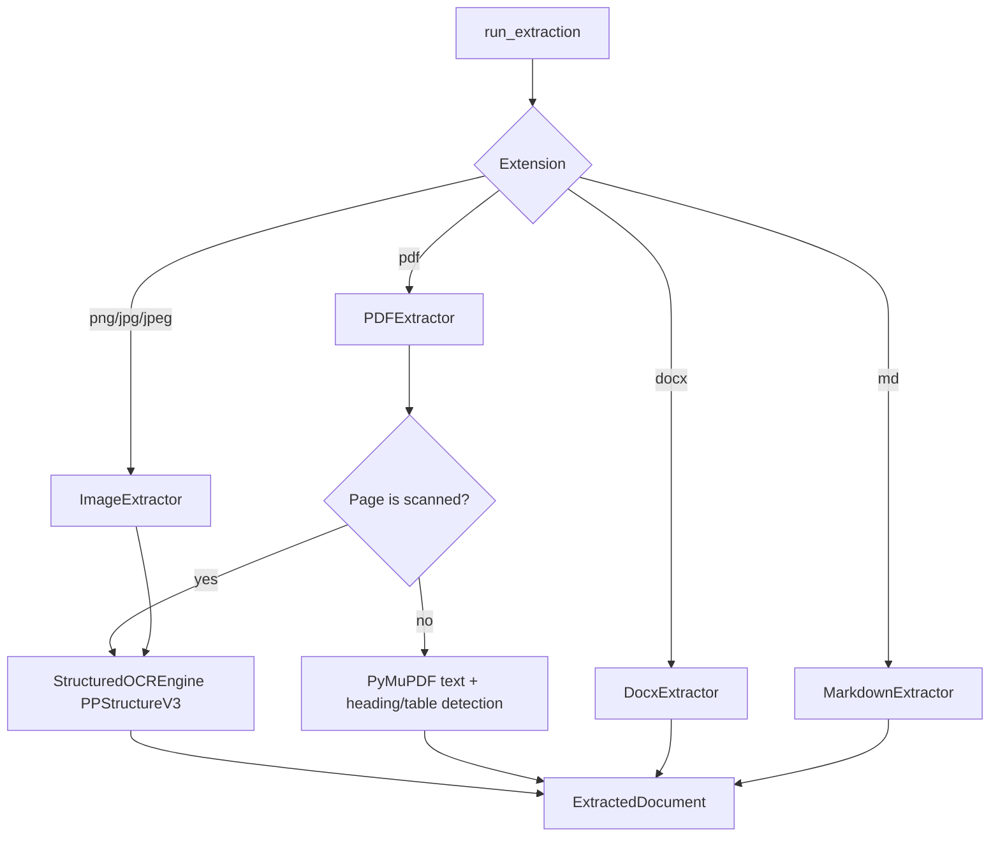
```mermaid
graph TD
  A[run_extraction] --> B{Extension}
  B -- pdf --> C[PDFExtractor]
  B -- docx --> D[DocxExtractor]
  B -- png/jpg/jpeg --> E[ImageExtractor]
  B -- md --> F[MarkdownExtractor]
  C --> G{Page is scanned?}
  G -- yes --> H[StructuredOCREngine PPStructureV3]
  G -- no --> I[PyMuPDF text + heading/table detection]
  E --> H
  H --> J[ExtractedDocument]
  I --> J
  D --> J
  F --> J
```

**Components:** `extraction/factory.py`, `base.py`, `pdf_extractor.py`, `docx_extractor.py`, `image_extractor.py`, `markdown_extractor.py`, `ocr_engine.py`, `heading_detector.py`, `table_markdown.py`.
**Failure points:** an unsupported extension raises `ValueError` in `get_extractor`, caught by the calling pipeline's broad exception handler and surfaced as a failed document; table detection failures degrade gracefully to prose-only output (logged, not fatal).

> **Note.** `extraction/ocr_extractor.py` is a standalone scratch script with a hardcoded local
> file path — it is **not** registered in `factory.py`'s dispatch table and is not part of the
> live extraction pipeline.

---

## Requirement Parsing

**Purpose:** Turn extracted document text into a structured, validated JSON shape the rest of the system (retrieval, drafting) can rely on.
**Entry point:** `tasks/requirement_processing.py::process_requirement_document_pipeline` — called synchronously from the upload endpoint, never as a standalone HTTP call.

**Step by step**
1. Status set to `EXTRACTING`.
2. File re-downloaded from S3 to a tempfile (deliberately re-fetched rather than reusing the original upload buffer).
3. `run_extraction` (see above) produces Markdown.
4. **Fatal step:** `parse_requirements` (`requirements_parsing/parser.py:17-76`) forces an LLM tool call against `RequirementsSchema` (project title, scope, deliverables, budget range, timeline, technical requirements, evaluation criteria, constraints), with up to 3 repair attempts on schema/validation failure. Raises after 3 failures — this failure is fatal to the whole document.
5. **Non-fatal step:** capability classification (see [Capability Tagging](#capability-tagging)) — degrades to an empty list on any failure.
6. Summary generation — a plain LLM completion producing a 2–4 sentence Markdown summary from the structured data.
7. Knowledge-match scoring — embeds the summary, queries Pinecone, returns the top 10 ranked document matches (empty if no knowledge chunks exist yet).
8. Everything persisted in one write; status set to `PARSED`.
9. Any exception anywhere in this sequence → status `FAILED`; the temp file is always cleaned up.

```
status = EXTRACTING
        │
        ▼
Download file from S3 (tempfile)
        │
        ▼
run_extraction → Markdown
        │
        ▼
parse_requirements (LLM, fatal, up to 3 repair attempts)
        │
        ▼
classify_capabilities (LLM, non-fatal — degrades to [])
        │
        ▼
summarize_requirements (LLM)
        │
        ▼
Knowledge-match scoring (embed summary → query Pinecone)
        │
        ▼
Persist all fields, status = PARSED
        │
        (any exception at any step) ──▶ status = FAILED
```

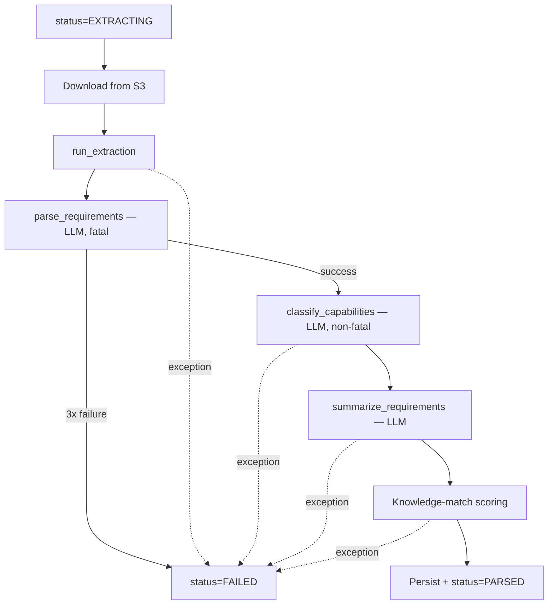
```mermaid
graph TD
  A[status=EXTRACTING] --> B[Download from S3]
  B --> C[run_extraction]
  C --> D[parse_requirements — LLM, fatal]
  D -- 3x failure --> E[status=FAILED]
  D -- success --> F[classify_capabilities — LLM, non-fatal]
  F --> G[summarize_requirements — LLM]
  G --> H[Knowledge-match scoring]
  H --> I[Persist + status=PARSED]
  C -.exception.-> E
  F -.exception.-> E
  G -.exception.-> E
  H -.exception.-> E
```

**Components:** `requirements_parsing/parser.py`, `schema.py` → `llm/chat_client.py::GroqChatClient` → `prompts/requirement_extraction.py` → `embedding/embedder.py` + `vectorstore/knowledge_store.py` for the knowledge-match step.
**Failure points:** LLM schema-validation failure after 3 attempts (fatal, document → `FAILED`); S3 download failure; no retry-from-failure path — a failed document must be re-uploaded.

---

## Capability Tagging

**Purpose:** Automatically classify an RFP against a fixed set of capability categories, as enrichment metadata.
**Entry point:** `requirements_parsing/capability_classifier.py::classify_capabilities`, called from within the requirement-parsing pipeline as a non-fatal step.

**Step by step**
1. Takes the already-structured requirements JSON (never the raw document text) as input.
2. System prompt (`prompts/capability_classification.py::build_system_prompt`) injects the fixed `KNOWLEDGE_CATEGORIES` vocabulary from `constants.py` at call time.
3. Single, tool-forced LLM call (`report_capability_tags`) — the model reports only categories that genuinely apply, each with a `0–1` confidence score. No repair loop.
4. Result validated against `CapabilityClassification`/`CapabilityTag` (`capability_schema.py`).
5. Any failure (missing tool call, exception) is caught by the pipeline's `_classify_capabilities_safely` wrapper and degrades to `[]` — never fails the document.
6. Persisted on `RequirementDocument.capability_tags` (JSONB); when a proposal has several requirement documents, `proposal_wizard_service.py::merge_capability_tags` unions their tags, keeping the highest confidence per tag name.

```
requirements_dict (already structured, not raw text)
        │
        ▼
Build system prompt with fixed KNOWLEDGE_CATEGORIES vocabulary
        │
        ▼
Single tool-forced LLM call (report_capability_tags)
        │
        ├─ failure ──▶ degrade to [] (non-fatal)
        │
        ▼
Validate against CapabilityClassification
        │
        ▼
Persist as RequirementDocument.capability_tags
```

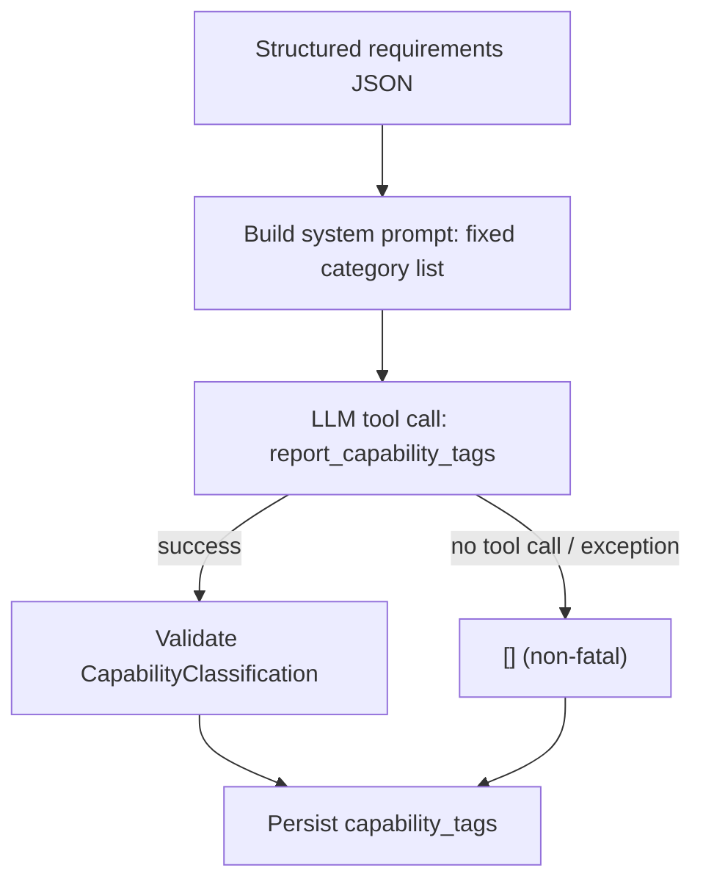
```mermaid
graph TD
  A[Structured requirements JSON] --> B[Build system prompt: fixed category list]
  B --> C[LLM tool call: report_capability_tags]
  C -- no tool call / exception --> D["[] (non-fatal)"]
  C -- success --> E[Validate CapabilityClassification]
  E --> F[Persist capability_tags]
  D --> F
```

**Components:** `requirements_parsing/capability_classifier.py`, `capability_schema.py` → `prompts/capability_classification.py` → `constants.py::KNOWLEDGE_CATEGORIES` → `llm/chat_client.py`.
**Failure points:** none that are user-visible — every failure mode degrades to an empty tag list rather than surfacing an error.

> **Partial implementation.** Capability tags are generated, persisted, merged across a
> proposal's documents, and returned via the API for display — but they are **not** currently
> used to scope or filter knowledge-base retrieval during proposal generation, despite the
> schema's own docstring describing that as the intent.

---

## Knowledge Repository CRUD

**Purpose:** Manage the organization's knowledge base — categories and the documents filed under them.
**Entry endpoints:** `/category` (`router/category.py`) and `/document` (`router/documents.py`)

**Step by step — documents**
1. **Create/edit** — `POST /document/upload` handles both via an optional `document_id` form field. Create requires `document_name`/`category_id`/`file`; edit accepts only the fields that changed. Replacing the file bumps `version` and schedules background reprocessing.
2. **Read** — `GET /document/{id}` single lookup; `GET /document/list` with search/category/status filters, pagination, and a toggle to include proposal-derived documents.
3. **Delete** — `DELETE /document/{id}` removes S3 file + Pinecone vectors + chunk rows, in that order, before soft-deleting the row.

**Step by step — categories**
1. **Create/update** — `POST /category`, keyed by an optional `id`. Creating onto a soft-deleted name revives that row instead of rejecting the request.
2. **List** — `GET /category/list`, with a live count of each category's active documents.
3. **Delete** — `DELETE /category/{id}`, refused with `409` while active documents still reference it.

```
POST /document/upload
        │
        ▼
document_id provided? ──yes──▶ Edit: apply only changed fields
        │no
        ▼
Validate required fields (name, category, file) ──▶ 422 if missing
        │
        ▼
Validate category exists ──▶ 404 if not
        │
        ▼
Upload file to S3 ──▶ 502 on failure
        │
        ▼
Create KnowledgeDocument row
        │
        ▼
Schedule background processing (chunk/embed/upsert)
        │
        ▼
Return DocumentResponse
```

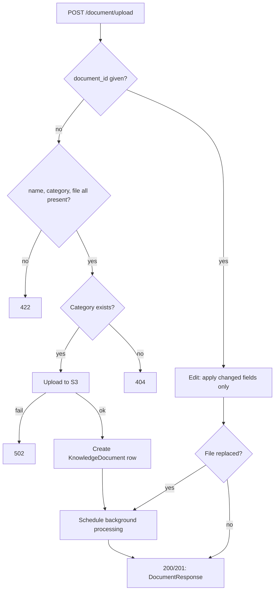
```mermaid
graph TD
  A[POST /document/upload] --> B{document_id given?}
  B -- yes --> C[Edit: apply changed fields only]
  B -- no --> D{name, category, file all present?}
  D -- no --> E[422]
  D -- yes --> F{Category exists?}
  F -- no --> G[404]
  F -- yes --> H[Upload to S3]
  H -- fail --> I[502]
  H -- ok --> J[Create KnowledgeDocument row]
  J --> K[Schedule background processing]
  C --> L{File replaced?}
  L -- yes --> K
  K --> M[200/201: DocumentResponse]
  L -- no --> M
```

**Components:** `router/documents.py`, `router/category.py` → `database/crud.py` → `utilities/s3_service.py` → `tasks/document_processing.py` (scheduled, not awaited) → `vectorstore/knowledge_store.py` (delete path).
**Failure points:** missing required fields (`422`); unknown/soft-deleted category (`404`); S3 failure (`502`); category deletion blocked by in-use documents (`409`).
**Authorization note:** gated on authentication only — no elevated role is required for document/category CRUD, unlike team or organization-settings management.

---

## Knowledge Document Ingestion

**Purpose:** The background pipeline triggered by a knowledge-document upload — extract, chunk, embed, and index the file so it becomes retrievable.
**Entry point:** `tasks/document_processing.py::process_knowledge_document(document_id)` — scheduled via FastAPI `BackgroundTasks` from `POST /document/upload`, never awaited inline.

**Step by step**
1. Opens its own DB session (background work never reuses a request-scoped session).
2. Status → `PROCESSING`.
3. Downloads the file from S3 to a tempfile, runs `extraction/factory.py::run_extraction`.
4. `chunk_document` (see [Document Chunking](#document-chunking)) splits the extracted Markdown, prefixed with a `"Category > Document Title"` breadcrumb.
5. `embed_texts` (see [Embedding Generation](#embedding-generation)) batches all chunks through the embedding client.
6. On reprocessing (a replaced file), prior vectors/chunk rows are deleted first — no orphaned data.
7. Chunks + embeddings upserted into Pinecone (see [Pinecone Storage](#pinecone-storage)); vector IDs persisted onto `KnowledgeChunk` rows.
8. Status → `INDEXED` on success, `FAILED` on any exception.

```
process_knowledge_document(document_id)  [background task]
        │
        ▼
status = PROCESSING
        │
        ▼
Download from S3 → run_extraction
        │
        ▼
chunk_document (heading-split + size/overlap sub-split)
        │
        ▼
embed_texts (batched HF Inference calls)
        │
        ▼
Delete prior vectors/chunks (if reprocessing)
        │
        ▼
upsert_chunks → Pinecone + persist KnowledgeChunk rows
        │
        ▼
status = INDEXED   (or FAILED on any exception)
```

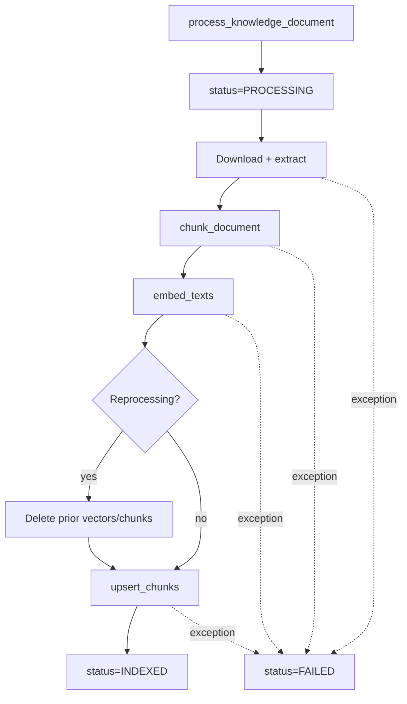
```mermaid
graph TD
  A[process_knowledge_document] --> B[status=PROCESSING]
  B --> C[Download + extract]
  C --> D[chunk_document]
  D --> E[embed_texts]
  E --> F{Reprocessing?}
  F -- yes --> G[Delete prior vectors/chunks]
  F -- no --> H[upsert_chunks]
  G --> H
  H --> I[status=INDEXED]
  C -.exception.-> J[status=FAILED]
  D -.exception.-> J
  E -.exception.-> J
  H -.exception.-> J
```

**Components:** `tasks/document_processing.py` → `extraction/factory.py` → `chunking/pipeline.py` → `embedding/embedder.py` → `vectorstore/knowledge_store.py` → `database/crud.py`.
**Failure points:** any step's exception → document status `FAILED`, logged with full context; no retry mechanism.

---

## Document Chunking

**Purpose:** Split extracted Markdown into retrieval-sized pieces that respect document structure, a token budget, and table integrity.
**Entry point:** `chunking/pipeline.py::chunk_document(document, root_prefix, chunk_size=500, chunk_overlap=50)`

**Step by step**
1. `split_by_headers` splits on `#`/`##`/`###` Markdown headings, producing `(content, breadcrumb)` pairs.
2. Each section is passed to `split_oversized_section` — sections already within the 500-token budget pass through unchanged.
3. An oversized section is segmented into table/non-table runs (`table_aware.py`): tables split strictly on row boundaries with the header re-emitted per piece; prose split via a token-aware recursive splitter with overlap.
4. Adjacent undersized pieces are greedily repacked so a short paragraph next to a small table doesn't become two tiny chunks.
5. Every final piece is prefixed with its full breadcrumb (`root_prefix > heading path`) directly into its content, wrapped in a `Chunk` (content, breadcrumb, sequential index, exact token count via `tiktoken`).

```
chunk_document(extracted_markdown, root_prefix)
        │
        ▼
split_by_headers → [(section_content, heading_breadcrumb), ...]
        │
        ▼
For each section: fits in 500 tokens?
        │ no
        ▼
Segment into table / prose runs
        │
        ├─ table → split on row boundaries, repeat header per piece
        └─ prose → recursive token-aware split, 50-token overlap
        │
        ▼
Greedily repack undersized adjacent pieces
        │
        ▼
Prefix breadcrumb into content → Chunk objects
```

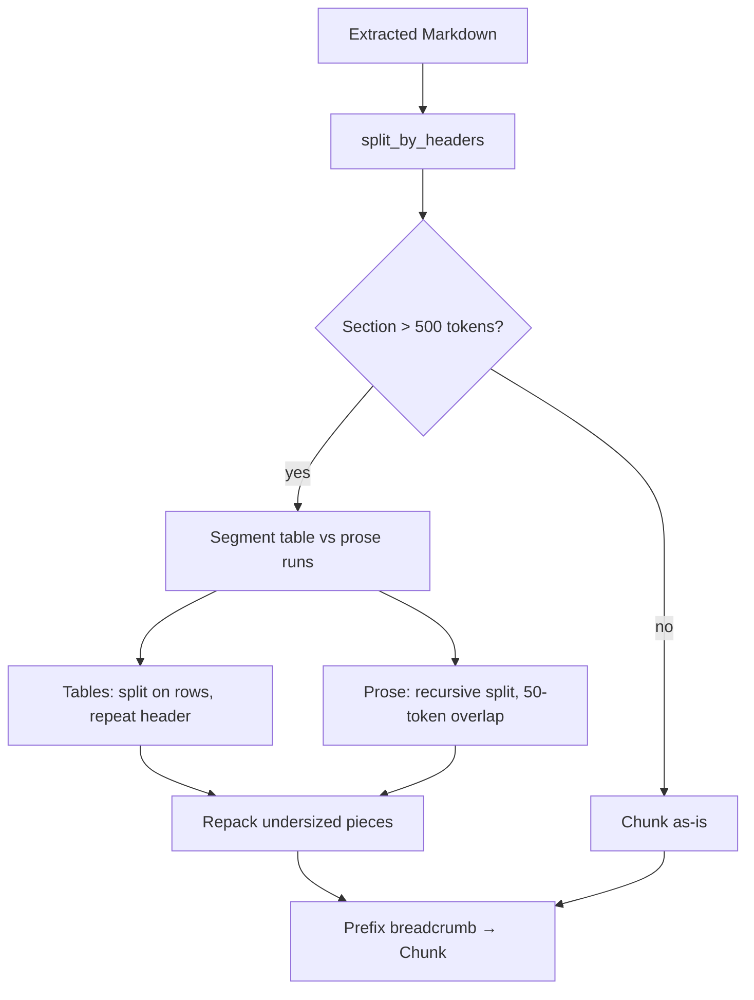
```mermaid
graph TD
  A[Extracted Markdown] --> B[split_by_headers]
  B --> C{Section > 500 tokens?}
  C -- no --> G[Chunk as-is]
  C -- yes --> D[Segment table vs prose runs]
  D --> E[Tables: split on rows, repeat header]
  D --> F[Prose: recursive split, 50-token overlap]
  E --> H[Repack undersized pieces]
  F --> H
  H --> I[Prefix breadcrumb → Chunk]
  G --> I
```

**Components:** `chunking/pipeline.py`, `markdown_splitter.py`, `recursive_splitter.py`, `table_aware.py`, `tokenization.py`, `models.py`.
**Failure points:** none of its own — relies on well-formed extracted Markdown as input; any failure surfaces via the calling pipeline's broad exception handling.
**Note:** `chunk_size`/`chunk_overlap` are real, threaded parameters, but the live call site (`tasks/document_processing.py`) never overrides them — every real chunking run uses the 500/50-token defaults.

---

## Embedding Generation

**Purpose:** Convert chunk text (and query text at retrieval time) into vectors using the same model, so they share one embedding space.
**Entry point:** `embedding/embedder.py::embed_texts(texts)` / `embed_query(text)`

**Step by step**
1. `embed_texts` batches input in groups of 32.
2. Each batch is sent to `HFInferenceEmbeddingClient.embed` (`embedding/hf_inference_client.py`) — a bearer-token POST to the Hugging Face Inference feature-extraction endpoint (model: `BAAI/bge-m3`, 1024 dimensions).
3. `response.raise_for_status()` — any non-2xx propagates as an exception to the caller.
4. `embed_query` is a single-string convenience wrapper over the same function, used at retrieval time.

```
embed_texts([chunk1.content, chunk2.content, ...])
        │
        ▼
Batch into groups of 32
        │
        ▼
POST to HF Inference feature-extraction endpoint (per batch)
        │
        ▼
raise_for_status() ──▶ propagates on failure
        │
        ▼
Return list[list[float]] (one 1024-dim vector per input)
```

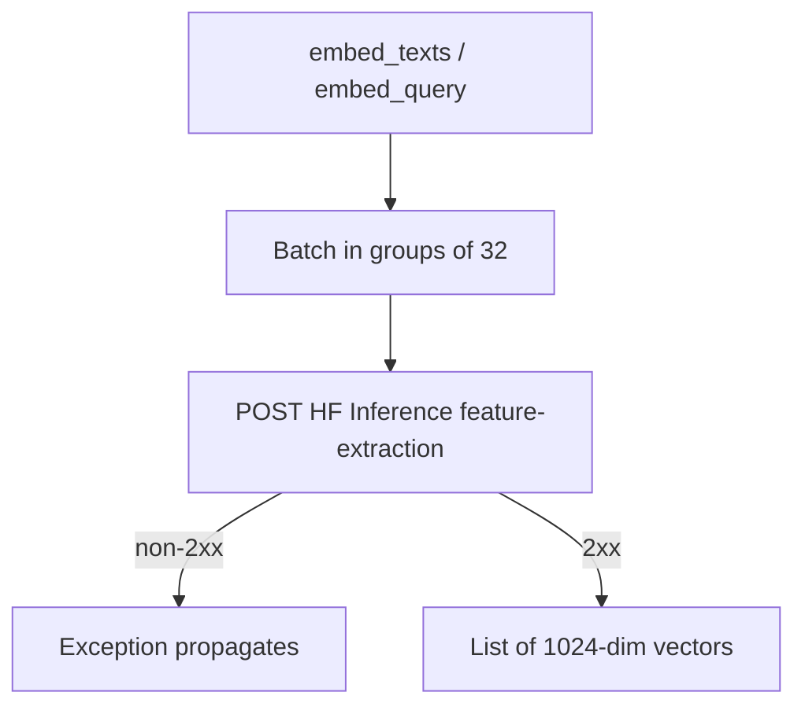
```mermaid
graph TD
  A[embed_texts / embed_query] --> B[Batch in groups of 32]
  B --> C[POST HF Inference feature-extraction]
  C -- non-2xx --> D[Exception propagates]
  C -- 2xx --> E[List of 1024-dim vectors]
```

**Components:** `embedding/embedder.py`, `hf_inference_client.py` → `config.py::HFInferenceConfig`.
**Failure points:** HF Inference API failure or timeout — propagates to and is caught by whichever pipeline called it (document/requirement processing, or generation retrieval).

---

## Pinecone Storage

**Purpose:** Persist embedded chunks with structured metadata so a similarity match is immediately usable for grounding or citation.
**Entry point:** `vectorstore/knowledge_store.py::upsert_chunks` / `delete_document_vectors`

**Step by step**
1. One index, one default namespace — no per-category/per-document namespace split. Provisioned idempotently by `PineconeIndexManager.create_index` (checks first, creates only if missing).
2. Each chunk gets a self-describing vector ID: `kdoc-{document_id}-{chunk_index}-{short uuid}`.
3. Metadata written per vector: `document_id`, `category_id`, `breadcrumb`, `chunk_index`, `source_filename`, the chunk's own `text` — plus `source_proposal_id`/`organization_name` only when the chunk originated from an approved proposal.
4. `index.upsert(vectors=...)` in one batched call; returns the generated IDs in input order for the caller to persist onto `KnowledgeChunk` rows.
5. Deletion (`delete_document_vectors`) filters by `document_id`; tolerant of a not-yet-existing namespace (first-ever upload).

```
upsert_chunks(document_id, category_id, chunks, embeddings)
        │
        ▼
Build vector ID per chunk (kdoc-{doc}-{idx}-{uuid})
        │
        ▼
Attach metadata (document_id, category_id, breadcrumb, text, ...)
        │
        ▼
index.upsert(vectors) — one batched call
        │
        ▼
Return vector IDs → persisted onto KnowledgeChunk rows
```

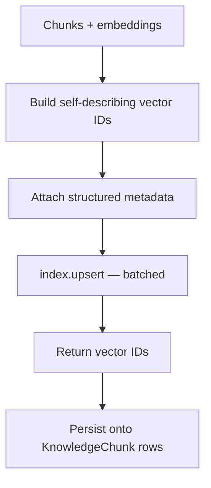
```mermaid
graph TD
  A[Chunks + embeddings] --> B[Build self-describing vector IDs]
  B --> C[Attach structured metadata]
  C --> D[index.upsert — batched]
  D --> E[Return vector IDs]
  E --> F[Persist onto KnowledgeChunk rows]
```

**Components:** `vectorstore/pinecone_client.py` (singleton client), `index_manager.py`, `knowledge_store.py`.
**Failure points:** Pinecone API failure propagates to the calling pipeline; deletion against a nonexistent namespace is explicitly absorbed, not an error.

---

## Vector Retrieval

**Purpose:** Turn a query embedding into a ranked, resolved, citation-ready set of chunks — shared logic behind both requirement knowledge-matching and proposal-section grounding.
**Entry points:** `vectorstore/knowledge_store.py::query_chunks` + `services/citation_service.py::resolve_and_filter_chunks`

**Step by step**
1. `query_chunks(embedding, top_k)` runs a top-k similarity search, normalizing each match to `{text, breadcrumb, document_id, source_filename, score}`.
2. For proposal-generation retrieval specifically: `retrieval_pool_size(top_k)` requests up to 3× the desired count (capped at 50) as headroom.
3. `resolve_and_filter_chunks` batch-resolves every match's source `KnowledgeDocument` in one query (not one per chunk), excludes chunks sourced from a previously approved proposal by default, then truncates back to `top_k`.
4. `label_knowledge_match` / `label_section_citation` shape the resolved results into the two output forms actually consumed: a requirement document's knowledge-match list, or a generated section's citation list.

```
embed_query(text) → query_embedding
        │
        ▼
query_chunks(query_embedding, top_k=retrieval_pool_size(N))  [over-fetch]
        │
        ▼
resolve_and_filter_chunks:
    batch-resolve source documents (1 query, not N)
    exclude proposal-sourced chunks by default
    truncate back to top_k
        │
        ▼
label_knowledge_match / label_section_citation
```

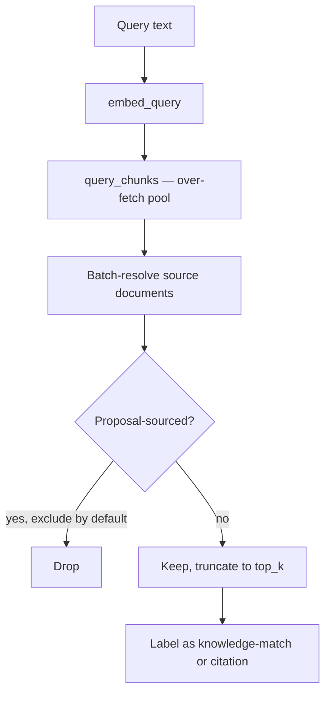
```mermaid
graph TD
  A[Query text] --> B[embed_query]
  B --> C[query_chunks — over-fetch pool]
  C --> D[Batch-resolve source documents]
  D --> E{Proposal-sourced?}
  E -- yes, exclude by default --> F[Drop]
  E -- no --> G[Keep, truncate to top_k]
  G --> H[Label as knowledge-match or citation]
```

**Components:** `vectorstore/knowledge_store.py`, `services/citation_service.py`. Consumed by [Requirement Parsing](#requirement-parsing) (knowledge-match scoring) and [Proposal Generation](#proposal-generation) (section grounding).
**Failure points:** Pinecone query failure propagates to the caller; short-circuits to an empty result if no knowledge chunks exist at all yet.

---

## Proposal Generation

**Purpose:** Draft a complete, multi-section proposal, grounded in structured requirements and (optionally) the knowledge base, streamed to the client as it's written.
**Entry endpoint:** `POST /proposal/generate` (`router/proposals.py:278-304`)

**Step by step**
1. Validates the proposal exists (`404` if not).
2. Returns a `StreamingResponse` (`text/event-stream`) wrapping `generate_proposal_stream` (`generation/proposal_generator.py`).
3. That function drives the LangGraph pipeline (see [LangGraph Workflow](#langgraph-workflow)) and translates its internal events into SSE lines: `section_start` → `section_chunk` (repeated) → `section_done` per section, then `done`.
4. Any exception during the run is caught, the proposal marked `FAILED` with the error message persisted, and an `error` SSE event sent — never an unhandled break in an already-started `200` response.

```
POST /proposal/generate {proposal_id, page_count, generation_mode}
        │
        ▼
Look up proposal ──▶ 404 if not found
        │
        ▼
StreamingResponse wrapping generate_proposal_stream
        │
        ▼
For each of 13 sections:
    section_start → section_chunk (repeated, live tokens) → section_done
        │
        ▼
done event  (or error event + proposal→FAILED on exception)
```

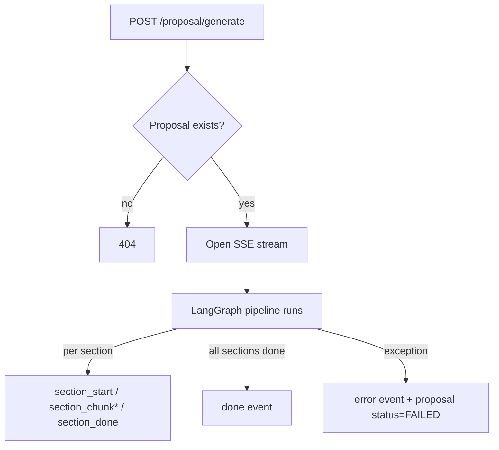
```mermaid
graph TD
  A[POST /proposal/generate] --> B{Proposal exists?}
  B -- no --> C[404]
  B -- yes --> D[Open SSE stream]
  D --> E[LangGraph pipeline runs]
  E -- per section --> F[section_start / section_chunk* / section_done]
  E -- all sections done --> G[done event]
  E -- exception --> H[error event + proposal status=FAILED]
```

**Components:** `router/proposals.py` → `generation/proposal_generator.py` → `generation/graph.py` (see next section).
**Failure points:** unknown/soft-deleted proposal (`404`); page count below the enforced minimum (`422`); any pipeline exception → `error` SSE event, proposal `FAILED`.

---

## LangGraph Workflow

**Purpose:** Orchestrate per-section drafting as an explicit state machine — context once, then retrieve → draft → persist, looping per section.
**Entry point:** `generation/graph.py::PROPOSAL_GENERATION_GRAPH` — a compiled LangGraph `StateGraph`, driven by `generate_proposal_stream`.

**Step by step**
1. **`load_context`** — fetches the proposal + its requirement documents, builds the combined structured-requirements JSON once, clears any previously persisted sections, transitions the proposal to `GENERATING`, and computes every section's word budget up front via a weighted allocation.
2. **`start_section`** — builds that section's drafting note (strict word range + required outline), initializes its working state, emits `section_start`.
3. **`retrieve`** — per-section retrieval (see [Vector Retrieval](#vector-retrieval)), a no-op unless knowledge-augmented mode is active.
4. **`draft`** — streams the section's content token-by-token from the LLM via a thread-bridged async iterator, emitting `section_chunk` per delta; marks status `APPROVED` once done (no automated quality-check loop is wired into this graph).
5. **`persist_section`** — writes the `ProposalSection` row immediately, emits `section_done`, advances the section index.
6. **Conditional edge** — loops back to `start_section` if sections remain, else proceeds to `compile_proposal`.
7. **`compile_proposal`** — assembles the final Markdown, uploads it to S3, transitions the proposal to `REVIEW`.

```
START
  │
  ▼
load_context  (fetch requirements, reset sections, status=GENERATING, compute word budgets)
  │
  ▼
┌─────────────► start_section (build drafting note, init section state)
│                  │
│                  ▼
│               retrieve (per-section RAG, if knowledge_augmented)
│                  │
│                  ▼
│               draft (stream tokens from LLM)
│                  │
│                  ▼
│               persist_section (write ProposalSection row)
│                  │
└── more sections? ┘
                  │ no
                  ▼
           compile_proposal (assemble Markdown, upload to S3, status=REVIEW)
                  │
                  ▼
                 END
```

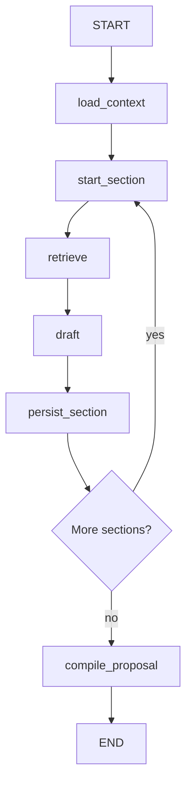
```mermaid
graph TD
  START --> load_context
  load_context --> start_section
  start_section --> retrieve
  retrieve --> draft
  draft --> persist_section
  persist_section --> more{More sections?}
  more -- yes --> start_section
  more -- no --> compile_proposal
  compile_proposal --> END
```

**Components:** `generation/graph.py`, `state.py`, `sections.py` (13 predefined sections with per-section weight/outline/query fields), `nodes.py`, `length_budget.py`, `markdown_sections.py`, `requirement_context.py` → `prompts/proposal_generation.py` → `llm/chat_client.py`.
**Failure points:** any node exception propagates up to `generate_proposal_stream`'s handler (see above).

> **Partial implementation.** `generation/nodes.py::run_quality_check` and
> `decide_section_status` — an LLM-based section review/revision-feedback mechanism — are fully
> implemented but **not called by this graph**. Every section is force-approved on its first
> draft; there is no automated retry-on-low-quality loop active today.

---

## Proposal Review

**Purpose:** Let a reviewer see a generated proposal's full content and curate its structure before export.
**Entry endpoints:** `GET /proposal/{id}/sections`, `PATCH /proposal/{id}/sections`, `PATCH /proposal/{id}/status` (`router/proposals.py:391-416,549-595`)

**Step by step**
1. **View** — `GET /proposal/{id}/sections` returns every section's ordered content for the reviewer UI.
2. **Reorder/remove** — `PATCH /proposal/{id}/sections`: sections omitted from the payload are deleted, sections included get their `order_index` set to the given order. Content editing/regeneration is not part of this endpoint.
3. **Status** — `PATCH /proposal/{id}/status` enforces a forward-only lifecycle (`INPROGRESS → GENERATING → REVIEW → DONE`, `FAILED` reachable anytime) via an explicit rank check — `409` on any backward move. Setting `DONE` schedules a background re-ingestion of the proposal's content into the knowledge base.

```
GET /proposal/{id}/sections  → full ordered content

PATCH /proposal/{id}/sections {sections: [{id, order}, ...]}
        │
        ▼
Sections omitted from payload → deleted
        │
        ▼
Sections included → order_index updated
        │
        ▼
Return updated ProposalDetailResponse

PATCH /proposal/{id}/status {status: "done"}
        │
        ▼
Rank check: new status ≥ current? ──▶ 409 if backward
        │
        ▼
Update status
        │
        ▼
status==DONE? → schedule ingest_proposal_as_knowledge (background)
```

```mermaid
graph TD
  A[PATCH /proposal/{id}/sections] --> B[Diff payload vs existing sections]
  B --> C[Delete omitted sections]
  B --> D[Reorder included sections]
  E[PATCH /proposal/{id}/status] --> F{New rank >= current rank?}
  F -- no --> G[409 Conflict]
  F -- yes --> H[Update status]
  H --> I{status == DONE?}
  I -- yes --> J[Schedule knowledge re-ingestion]
  I -- no --> K[Return]
```

**Components:** `router/proposals.py` → `services/proposal_review_service.py` → `services/proposal_knowledge_service.py` (re-ingestion) → `database/crud.py`.
**Failure points:** section belonging to another proposal (`400`); backward status transition (`409`).

> **Partial implementation.** There is no endpoint to edit a section's text content or regenerate
> it individually — review is limited to viewing, reordering, and removing sections. A prior
> per-section `regenerate_section`/`approve_section` design existed but was removed (see the
> Alembic migration `5e6f7a8b9c0d_drop_unused_proposal_columns.py`'s own docstring) — it never had
> a router endpoint.

---

## Proposal Export

**Purpose:** Render the proposal's current content as a downloadable PDF/DOCX, optionally emailed directly to a recipient.
**Entry endpoints:** `POST /proposal/{id}/export`, `POST /proposal/{id}/export/email` (`router/proposals.py:419-465`)

**Step by step**
1. `render_proposal_document` (`services/proposal_export_service.py:45-103`) loads the proposal — `404` if missing, `409` if it has no sections yet.
2. Current sections assembled into Markdown, then parsed into a JSON snapshot (`generation/markdown_sections.py`) — built live from the current rows every time, not a frozen snapshot.
3. Rendered to HTML via the selected template (`rendering/html_renderer.py`, one of 4 templates), with organization settings populating cover-page details.
4. HTML → PDF (WeasyPrint) or → DOCX (Pandoc, using the template's reference document) — `502` on rendering failure.
5. Proposal status set to `DONE` if not already.
6. **Direct export** returns the file as a binary response; **email export** additionally emails it as an attachment and confirms via `ProposalExportEmailResponse`.

```
POST /proposal/{id}/export {template_id, format}
        │
        ▼
Load proposal ──▶ 404 if missing, 409 if no sections
        │
        ▼
Assemble Markdown from current sections → JSON snapshot
        │
        ▼
Render HTML (Jinja2 template + organization settings)
        │
        ▼
HTML → PDF (WeasyPrint) or DOCX (Pandoc) ──▶ 502 on failure
        │
        ▼
Set proposal status = DONE
        │
        ▼
Return file (or: also email it, for /export/email)
```

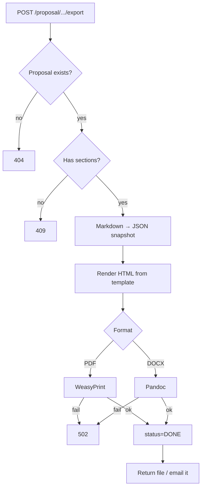
```mermaid
graph TD
  A[POST /proposal/.../export] --> B{Proposal exists?}
  B -- no --> C[404]
  B -- yes --> D{Has sections?}
  D -- no --> E[409]
  D -- yes --> F[Markdown → JSON snapshot]
  F --> G[Render HTML from template]
  G --> H{Format}
  H -- PDF --> I[WeasyPrint]
  H -- DOCX --> J[Pandoc]
  I -- fail --> K[502]
  J -- fail --> K
  I -- ok --> L[status=DONE]
  J -- ok --> L
  L --> M[Return file / email it]
```

**Components:** `router/proposals.py` → `services/proposal_export_service.py` → `generation/markdown_sections.py` → `rendering/html_renderer.py`, `html_templates.py`, `renderer.py` → `utilities/email_service.py` (email variant only).
**Failure points:** proposal not found (`404`); no sections yet (`409`); render failure (`502`); email send failure (`502`).

> **Partial implementation.** Export is not gated on any approval state — it renders directly
> from the live section rows regardless of review status. Exported bytes are returned/emailed and
> never persisted to S3, despite `S3PathBuilder.proposal_pdf`/`proposal_docx` existing for that
> purpose.

---

## Proposal History

**Purpose:** Let a user find and track proposals across the organization.
**Entry endpoints:** `GET /proposal`, `GET /proposal/stats` (`router/proposals.py:326-367`)

**Step by step**
1. `GET /proposal` — search (title/client name), filters (status, creator, created-date range), paginated, newest-first (`build_proposals_query` + `paginate`, the same pattern used for document listings).
2. `GET /proposal/stats` — total active count plus a per-status breakdown, every status represented even at zero.

```
GET /proposal?search=&status=&created_by=&page=&limit=
        │
        ▼
build_proposals_query (search/status/creator/date filters)
        │
        ▼
paginate() → {page, limit, total_pages, total, data[]}
        │
        ▼
Map each Proposal → ProposalResponse

GET /proposal/stats
        │
        ▼
get_proposal_status_counts → {inprogress, generating, review, done, total}
```

```mermaid
graph TD
  A[GET /proposal] --> B[build_proposals_query]
  B --> C[paginate]
  C --> D[Map to ProposalResponse list]
  E[GET /proposal/stats] --> F[get_proposal_status_counts]
  F --> G[Fill every status, zero-filled if empty]
```

**Components:** `router/proposals.py` → `services/proposal_review_service.py` → `database/crud.py` → `utilities/pagination.py`.
**Failure points:** none beyond standard auth/validation — this is a pure read path.
**Note:** there is no version-history mechanism for a proposal's content — `Proposal` has no version field, and no endpoint returns prior states of a proposal's sections. "History" here means listing/filtering/status-tracking, not content versioning.

---

## Administration APIs

**Purpose:** Admin-only management of team membership and organization-wide settings, plus self-service profile management for any user.

**Team management — `/team`, admin-only.** `POST /team/invite` generates a temporary password
(email-safe character set, see `utilities/generic.py::generate_temp_password`), creates the
account, and emails the credential — `502` (account already created) if the email fails to send.
`GET /team/members` lists members, paginated. `PATCH .../role` and `PATCH .../status` update role
or active/inactive state; `DELETE /team/members/{id}` soft-deletes. All three mutation endpoints
share guards: an admin cannot act on their own account, and the last remaining admin cannot be
demoted, deactivated, or deleted.

**Organization settings — `/organization-settings`, admin-only.** `GET` returns an all-empty
response rather than `404` if no row exists yet. `PUT` creates-or-updates the single settings row
with partial-update semantics (omitted field = untouched, explicit null = cleared).
`POST`/`DELETE /logo` handle branding image upload/removal via S3, kept separate from the main
settings form.

**Profile — `/profile`, any authenticated user, self only.** Identity is always taken from the
JWT (`current_user["user_id"]`), never from a request parameter. Email is read-only (it's the
login identifier); password changes go through `/auth/reset_password`, not this endpoint.

```
POST /team/invite {email, role}
        │
        ▼
Check email not already registered ──▶ 409
        │
        ▼
generate_temp_password (email-safe charset)
        │
        ▼
Create User row (is_first_login=True)
        │
        ▼
Email temp password ──▶ 502 if send fails (account still created)
        │
        ▼
Return InviteTeamMemberResponse

PATCH /team/members/{id}/role or /status
        │
        ▼
Target is self? ──▶ 400
        │
        ▼
Target is last active admin (being demoted/deactivated)? ──▶ 400
        │
        ▼
Apply change
```

```mermaid
graph TD
  A[POST /team/invite] --> B{Email already exists?}
  B -- yes --> C[409]
  B -- no --> D[generate_temp_password]
  D --> E[Create User row]
  E --> F[Send invite email]
  F -- fail --> G[502, account still exists]
  F -- ok --> H[201: InviteTeamMemberResponse]
  I[PATCH role/status] --> J{Acting on self?}
  J -- yes --> K[400]
  J -- no --> L{Last active admin affected?}
  L -- yes --> K
  L -- no --> M[Apply change]
```

**Components:** `router/team.py`, `router/organization_settings.py`, `router/profile.py` → `services/team_service.py`, `services/organization_settings_service.py` → `utilities/generic.py`, `utilities/email_service.py`, `utilities/s3_service.py` → `database/crud.py`.
**Failure points:** duplicate email (`409`); self-action or last-admin guard violations (`400`); invite email failure (`502`, non-reversible — the account already exists).

---

*Backend workflow reference for the Proposal AI project — grounded in the codebase as it stands,
including what is only partially wired up. Intended to stay current as a living reference, not a
snapshot of one point in time.*
