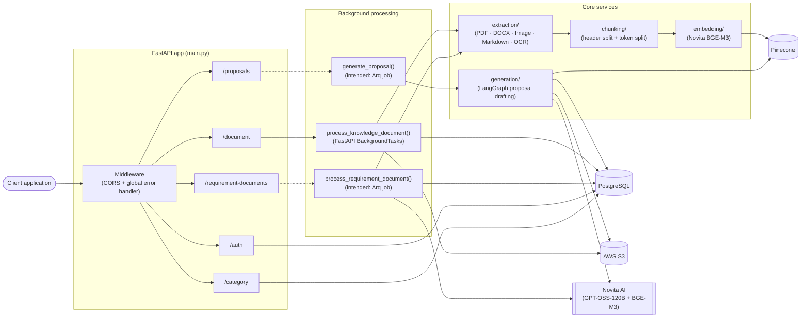
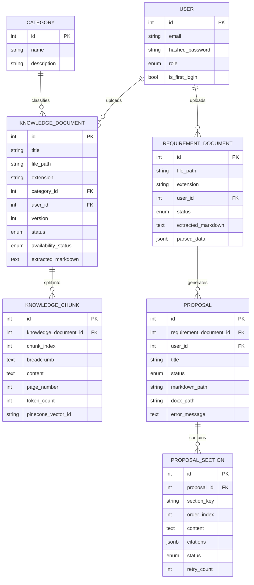
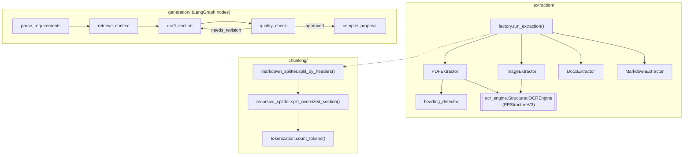
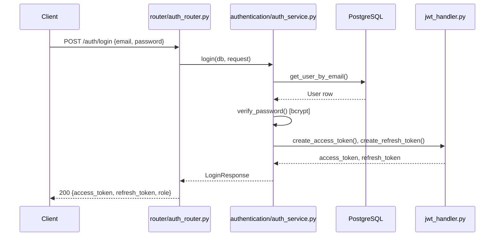
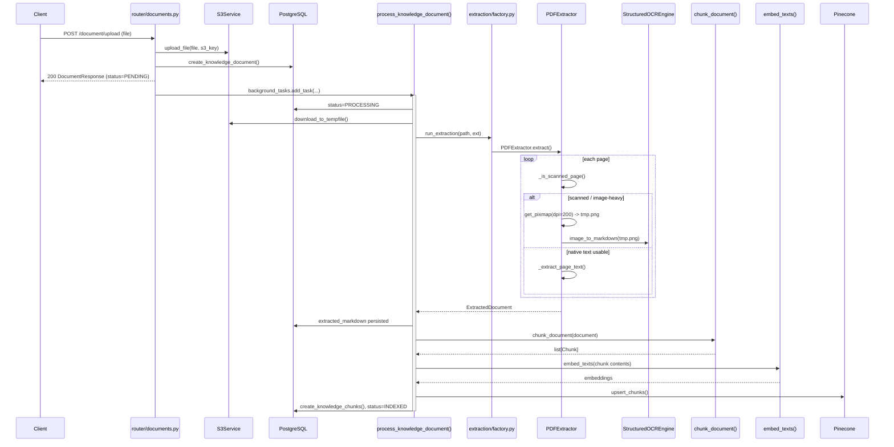
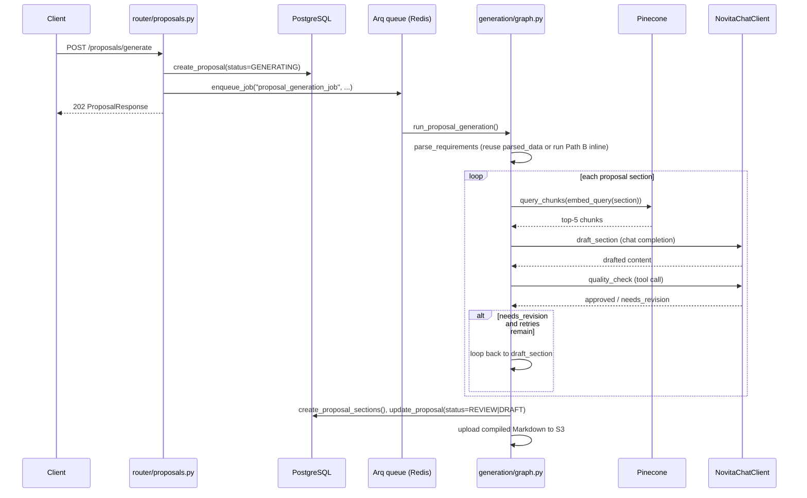

# Proposal AI — Backend

A FastAPI backend with two connected pipelines:

1. **Knowledge Base (RAG) ingestion** — upload PDFs/DOCX/images/Markdown, extract text (with OCR fallback for scanned content), chunk, embed, and index into Pinecone for retrieval.
2. **AI Proposal Generation** — upload an RFP/requirement document, extract structured requirements with an LLM, retrieve relevant knowledge-base context per section, and draft + quality-check a full client proposal via a LangGraph state machine.

This document is a from-source map of the codebase — every module, flow, and diagram below reflects what is actually implemented, including gaps that exist today.

## Table of contents

1. [Project overview](#1-project-overview)
2. [High-level architecture](#2-high-level-architecture)
3. [Folder structure](#3-folder-structure)
4. [Important modules and responsibilities](#4-important-modules-and-responsibilities)
5. [API flow](#5-api-flow)
6. [Authentication flow](#6-authentication-flow)
7. [Database architecture](#7-database-architecture)
8. [Background tasks](#8-background-tasks)
9. [Document processing pipeline](#9-document-processing-pipeline)
10. [OCR pipeline (current implementation)](#10-ocr-pipeline-current-implementation)
11. [Chunking pipeline](#11-chunking-pipeline)
12. [Embedding pipeline](#12-embedding-pipeline)
13. [Pinecone integration](#13-pinecone-integration)
14. [Storage flow (S3, PostgreSQL, Pinecone)](#14-storage-flow-s3-postgresql-pinecone)
15. [Configuration (.env variables)](#15-configuration-env-variables)
16. [Third-party libraries used and why](#16-third-party-libraries-used-and-why)
17. [Important classes and services](#17-important-classes-and-services)
18. [End-to-end request flow](#18-end-to-end-request-flow)
19. [Architecture diagrams](#19-architecture-diagrams)
20. [Sequence diagrams](#20-sequence-diagrams)
21. [Current strengths](#21-current-strengths)
22. [Current limitations](#22-current-limitations)
23. [Suggested improvements](#23-suggested-improvements)

---

## 1. Project overview

**Proposal AI** (see `main.py`, `FastAPI(title="Proposal AI")`) is a Python 3.12 / FastAPI backend for an organization that wants to turn its internal knowledge base into AI-drafted client proposals.

It serves two audiences within the same system:

- **Knowledge managers** upload reference material (case studies, pricing sheets, past SOWs, capability docs) into categorized **Knowledge Documents**. These are extracted, chunked, embedded, and stored in Pinecone as a retrieval corpus.
- **Bid/proposal writers** upload an incoming **Requirement Document** (an RFP). The system extracts structured requirements from it with an LLM, then generates a full proposal by drafting each standard section (executive summary, technical approach, pricing, etc.) grounded in retrieved knowledge-base context, running each draft through an automated quality check before compiling the final document.

Both pipelines share one extraction layer, so PDFs, DOCX files, standalone images (scanned documents), and Markdown are all normalized to the same internal representation regardless of which pipeline they enter through.

## 2. High-level architecture



The two dashed arrows (`RR`/`PR` → their jobs) mark the Arq-queued paths — see [§8 Background tasks](#8-background-tasks) and [§22 Current limitations](#22-current-limitations) for why these are currently non-functional as wired.

## 3. Folder structure

| Folder | Purpose |
|---|---|
| `alembic/` | Alembic migration environment (`env.py`) and version scripts. Schema is actually bootstrapped via SQLAlchemy `Base.metadata.create_all` on app startup (see `main.py`); Alembic currently carries one incremental migration on top of that. |
| `authentication/` | Password hashing (bcrypt via passlib), JWT issuance/verification, and FastAPI auth dependencies (`get_current_user`, `require_role`). |
| `chunking/` | Format-agnostic Markdown chunking: header-based splitting, token-bounded recursive sub-splitting, and the `Chunk` data model. |
| `common/storage/` | A `StorageService` port/adapter abstraction (ABC + S3 implementation with typed exceptions and retry config). Not currently imported by any router or task — see [§22](#22-current-limitations). |
| `database/` | Async SQLAlchemy engine/session setup, ORM models, enums, and CRUD helper functions. |
| `embedding/` | Novita BGE-M3 embedding client and batching helper used by both indexing and retrieval. |
| `extraction/` | Format-specific document extractors (PDF, DOCX, Image, Markdown) that all converge on a single `ExtractedDocument` contract. Owns the OCR engine wrapper. |
| `generation/` | LangGraph state machine that parses requirements, retrieves context, drafts each proposal section, and quality-checks it. |
| `llm/` | Shared Novita chat-completions client (OpenAI-compatible SDK) used by both requirements parsing and proposal drafting. |
| `middleware/` | CORS configuration and the global error-handling middleware, wired together in one place. |
| `RAG/` | Two placeholder modules (`chunking.py`, `retriever.py`) — both currently empty. Not used by the live pipeline; see [§22](#22-current-limitations). |
| `requirements_parsing/` | Structured extraction of RFP requirements into a validated Pydantic schema via an LLM tool call. |
| `router/` | FastAPI routers: `auth_router`, `category`, `documents`, `requirements`, `proposals`. |
| `schemas/` | Pydantic request/response models, one module per resource. |
| `tasks/` | Background-job entry points invoked from routers (`document_processing`, `requirement_processing`, `proposal_generation`). |
| `test/` | A single ad-hoc script (`test_hash.py`) — not a pytest suite; see [§22](#22-current-limitations). |
| `utilities/` | Logger factory, the live S3 client/path builder, a pagination helper, and small generic helpers (role assignment, filename sanitizing, temp-password generation). |
| `vectorstore/` | Pinecone client singleton, index creation helper, and knowledge-chunk upsert/delete/query functions. |
| `config.py` | `pydantic-settings` `AppConfig`, loaded from a single `CONFIG` JSON environment variable. |
| `constants.py` | Fixed catalog of knowledge-base categories (`KNOWLEDGE_CATEGORIES`). |
| `main.py` | FastAPI app instantiation, middleware/router registration, and startup schema creation. |
| `requirements.txt` | Pinned Python dependencies. |

## 4. Important modules and responsibilities

| Module | Responsibility |
|---|---|
| `extraction/factory.py` | Single entry point (`run_extraction`) that dispatches to the right extractor by file extension. Used identically by both pipelines. |
| `extraction/base.py` | Defines `BaseExtractor`, `ExtractedDocument`, `ExtractedPage`, `ExtractionMethod` — the contract every format converges on. |
| `extraction/ocr_engine.py` | `StructuredOCREngine` — lazy singleton wrapper around PaddleOCR's `PPStructureV3`. The only sanctioned OCR entry point. |
| `extraction/pdf_extractor.py` | PyMuPDF-based PDF extraction with per-page native-text-vs-OCR routing and heading detection. |
| `extraction/docx_extractor.py` | python-docx based DOCX → Markdown conversion, preserving heading styles, lists, and tables. |
| `extraction/image_extractor.py` | Standalone image uploads → OCR unconditionally. |
| `extraction/heading_detector.py` | Shared heading-scoring heuristic (size/bold/underline/numbering/caps) reused by the PDF and DOCX extractors. |
| `chunking/pipeline.py` | Orchestrates header-split → oversized-section sub-split → breadcrumb-prefixed `Chunk` objects with resolved page numbers. |
| `embedding/embedder.py` | Batches text to the embedding client; exposes `embed_texts` (indexing) and `embed_query` (retrieval) over the same embedding space. |
| `vectorstore/knowledge_store.py` | `upsert_chunks`, `delete_document_vectors`, `query_chunks` — all Pinecone read/write for the knowledge base. |
| `generation/graph.py` / `generation/nodes.py` | The LangGraph proposal-generation state machine and its five node implementations. |
| `requirements_parsing/parser.py` | Turns extracted RFP Markdown into a validated `RequirementsSchema` via an LLM tool call, with schema-repair retries. |
| `database/crud.py` | All CRUD/query functions used by routers and background tasks — the only place raw SQLAlchemy queries for these entities live. |
| `authentication/jwt_handler.py` | Issues and verifies access/refresh JWTs. |
| `authentication/dependency.py` | `get_current_user` and `require_role(*roles)` FastAPI dependencies; password hash/verify helpers. |
| `middleware/error_handler.py` | Global exception-to-JSON translation for every request. |
| `utilities/s3_service.py` | The S3 client actually used across the app: upload/download/delete/presign, plus `S3PathBuilder` for consistent key layout. |

## 5. API flow

| Router | Prefix | Endpoints | Auth required |
|---|---|---|---|
| `auth_router` | `/auth` | `POST /register`, `POST /login`, `POST /refresh`, `POST /reset_password`, `POST /create-user` | `reset_password` (any user), `create-user` (ADMIN only) |
| `category` | `/category` | `POST ""` (create/update), `GET /list` | none enforced |
| `documents` | `/document` | `POST /upload`, `POST /{id}/process`, `GET /list`, `GET /{id}`, `GET /{id}/download`, `DELETE /{id}` | `upload` requires auth |
| `requirements` | `/requirement-documents` | `POST /upload`, `POST /{id}/process`, `GET /{id}` | `upload` requires auth |
| `proposals` | `/proposals` | `POST /generate`, `GET /{id}` | `generate` requires auth |

Every mutating request passes through `ErrorHandlerMiddleware` (translates `SQLAlchemyError` → 503, anything else unhandled → 500, `HTTPException`s pass through) and CORS (`middleware/middleware.py` wires both, error handler innermost so CORS headers still land on its JSON responses).

Upload endpoints follow the same shape: validate → upload raw bytes to S3 → create a DB row in a `PENDING`/`UPLOADING` status → schedule background processing → return immediately. Clients poll `GET /{id}` to observe status transitions.

## 6. Authentication flow

- Passwords are hashed with **bcrypt** via `passlib.CryptContext` (`authentication/dependency.py`).
- **Access tokens** and **refresh tokens** are both JWTs (`python-jose`), signed with `HS256` by default, carrying `user_id`, `email`/(access only), `role`/(access only), `token_type` (`"access"`/`"refresh"`), `iat`, `exp`, and `iss` (`authentication/jwt_handler.py`).
- `get_current_user` is a FastAPI dependency (`HTTPBearer`) that decodes and validates the access token, rejecting the wrong `token_type`.
- `require_role(*roles)` wraps `get_current_user` to enforce RBAC — currently applied only to `POST /auth/create-user` (ADMIN only).
- Roles are binary: `UserRole.ADMIN` ("org_admin") and `UserRole.USER` ("member"); `utilities/generic.py::assign_role` maps a boolean "is organization admin" flag to one of the two at registration.
- There is no server-side token revocation/blacklist — the `/auth/logout` endpoint exists in `schemas/auth.py` but is commented out in `router/auth_router.py`; logout is effectively client-side (discard the tokens).

See the login sequence diagram in [§20](#20-sequence-diagrams).

## 7. Database architecture

PostgreSQL, accessed through **SQLAlchemy 2.0** (`Mapped`/`mapped_column` style) over **asyncpg** at runtime; **Alembic** uses the synchronous **psycopg2** driver for migrations (`alembic/env.py` swaps the driver in `SYNC_DATABASE_URL`). All tables inherit `BasicModel` (`database/models.py`): `id`, `is_active`, `created_at`, `updated_at`.



Enums (`database/db_enum.py`): `UserRole`, `IngestionStatus` (knowledge docs), `DocumentStatus` (requirement docs), `DocumentAvailability`, `ProposalStatus`, `ProposalSectionStatus`.

Schema lifecycle: `main.py`'s `lifespan` context creates the Postgres `userrole` enum type and runs `Base.metadata.create_all(checkfirst=True)` on every app startup (idempotent). `alembic/versions/` currently holds one migration (`872db9f9115a_add_extracted_markdown`) layered on top of that baseline.

## 8. Background tasks

Two different mechanisms are used for background work, and only one is fully wired end-to-end today:

| Pipeline | Trigger | Mechanism | Status |
|---|---|---|---|
| Knowledge document ingestion | `POST /document/upload`, `POST /document/{id}/process` | FastAPI `BackgroundTasks.add_task(process_knowledge_document, id)` — runs in-process, same worker | **Working** |
| Requirement document extraction | `POST /requirement-documents/upload`, `POST /requirement-documents/{id}/process` | Intended: `arq` job (`get_arq_pool().enqueue_job("requirement_document_job", ...)`), Redis-backed | **Not wired** — `tasks/arq_pool.py` (the module both routers import `get_arq_pool` from) does not exist in the codebase |
| Proposal generation | `POST /proposals/generate` | Intended: `arq` job (`enqueue_job("proposal_generation_job", ...)`) | **Not wired** — same missing module |

The job bodies themselves are fully implemented (`tasks/requirement_processing.py::process_requirement_document`, `tasks/proposal_generation.py::generate_proposal`) — what's missing is the Arq connection pool factory and a registered worker process to consume the queue. See [§22](#22-current-limitations).

## 9. Document processing pipeline

Entry point: `tasks/document_processing.py::process_knowledge_document(document_id)`.

1. Open a dedicated DB session (the request-scoped session from the upload endpoint is already closed by the time this background task runs).
2. Load the `KnowledgeDocument` row, set `status=PROCESSING`.
3. Download the file from S3 to a local temp path.
4. `extraction.factory.run_extraction(path, filename, extension)` → dispatches by extension to `PDFExtractor` / `DocxExtractor` / `ImageExtractor` / `MarkdownExtractor` (OCR runs inside this step where applicable — see [§10](#10-ocr-pipeline-current-implementation)).
5. Persist `extracted_markdown` onto the row immediately (durable even if a later step fails).
6. `chunking.pipeline.chunk_document()` → list of `Chunk` objects (see [§11](#11-chunking-pipeline)).
7. `embedding.embedder.embed_texts()` → one embedding vector per chunk (see [§12](#12-embedding-pipeline)).
8. Delete any prior vectors/chunk rows for this document (supports re-processing a new file version without orphaned data).
9. `vectorstore.knowledge_store.upsert_chunks()` writes to Pinecone; matching `KnowledgeChunk` rows are written to Postgres with the returned vector IDs.
10. `status=INDEXED` (or `FAILED`, logged via `logger.exception`, on any exception in steps 3–9).
11. The local temp file is always deleted in a `finally` block.

## 10. OCR pipeline (current implementation)

**Engine:** PaddleOCR's `PPStructureV3` (`paddleocr==3.7.0`), wrapped as a lazy singleton in `extraction/ocr_engine.py::StructuredOCREngine`:

```python
class StructuredOCREngine:
    _engine: PPStructureV3 | None = None

    @classmethod
    def get_engine(cls) -> PPStructureV3:
        if cls._engine is None:
            cls._engine = PPStructureV3(
                use_doc_orientation_classify=False,
                use_doc_unwarping=False,
            )
        return cls._engine

    @classmethod
    def image_to_markdown(cls, image_path: str) -> str:
        engine = cls.get_engine()
        results = engine.predict(image_path)
        ...  # joins each result's result.markdown["markdown_texts"]
```

PPStructureV3 was chosen because it is **layout-aware**: it emits Markdown per detected region (paragraphs, tables) instead of an unordered bag of recognized text lines, which matches the pipeline's single `ExtractedDocument.markdown` contract without a separate layout-reconstruction step.

**Two call sites:**

- `extraction/image_extractor.py` — every standalone image upload (`.png`/`.jpg`/`.jpeg`) goes straight to OCR, unconditionally.
- `extraction/pdf_extractor.py` — OCR runs **only** for pages classified as scanned, via a per-page triage heuristic:
  - A page is trusted to skip OCR only if it has **≥ 40 characters** of native extractable text **and** embedded images cover **< 60%** of the page area (`MIN_NATIVE_TEXT_CHARS`, `IMAGE_COVERAGE_THRESHOLD`).
  - Otherwise the page is rasterized to a PNG at a fixed **200 DPI** via PyMuPDF (`page.get_pixmap(dpi=200)`), written to a temp file, OCR'd, and the temp file deleted.

**Known characteristics worth knowing before extending this pipeline:**

- `use_doc_orientation_classify=False` and `use_doc_unwarping=False` disable PPStructureV3's own rotation-detection and page-unwarping — there is no rotation/deskew correction anywhere in this codebase today.
- No grayscale conversion, thresholding, denoising, sharpening, morphology, or contour detection is implemented by hand; only rasterization (PDF→image) and the text/coverage triage above are custom code.
- OCR calls have no retry, timeout, or per-page fault isolation — one bad page fails the entire document (caught only by the whole-pipeline `except Exception` in `process_knowledge_document`).
- A second, unrelated script, `extraction/ocr_extractor.py`, also imports `PaddleOCR` directly but is **not referenced anywhere** in the codebase — do not treat it as a second supported OCR path; see [§22](#22-current-limitations).

## 11. Chunking pipeline

Entry point: `chunking/pipeline.py::chunk_document(document, root_prefix)`.

1. **Header split** — `chunking/markdown_splitter.py::split_by_headers` uses LangChain's `MarkdownHeaderTextSplitter` on `#`/`##`/`###` to produce `(content, breadcrumb)` pairs, e.g. `"Technical Approach > Architecture"`.
2. **Oversized-section split** — `chunking/recursive_splitter.py::split_oversized_section` measures each section against **500 tokens** (`DEFAULT_CHUNK_SIZE_TOKENS`) using `tiktoken`'s `cl100k_base` encoding; sections over the limit are recursively sub-split with **50-token overlap** (`RecursiveCharacterTextSplitter.from_tiktoken_encoder`).
3. **Breadcrumb prefixing** — every chunk's content is prefixed with `"{root_prefix} > {breadcrumb}: "` (e.g. `"AI & ML Solutions > Case Study Deck: ..."`) so retrieved chunks carry full context even outside their source document.
4. **Page number resolution** — `_locate_page` finds each section's approximate character offset in the joined document markdown and maps it back to a page number using per-page offsets built from `ExtractedDocument.pages`.
5. Output: a flat `list[Chunk]` (`content`, `breadcrumb`, `chunk_index`, `token_count`, `page_number`).

`cl100k_base` is used purely for consistent chunk-sizing — it does not need to match BGE-M3's own tokenizer exactly.

## 12. Embedding pipeline

`embedding/embedder.py` wraps `embedding/novita_client.py::NovitaEmbeddingClient`, a thin client over Novita's **OpenAI-compatible embeddings endpoint** running **BGE-M3** (1024-dimensional, per `PineconeConfig.dimension`).

- `embed_texts(texts)` — batches requests in groups of **32** (`BATCH_SIZE`, chosen to stay under Novita's payload limits) and is used to embed every chunk during ingestion.
- `embed_query(text)` — embeds a single query string (a section's title + requirement fields) into the **same embedding space**, used during proposal generation's context-retrieval step (`generation/nodes.py::retrieve_context`).

## 13. Pinecone integration

- `vectorstore/pinecone_client.py::PineconeService` — a lazy singleton client (`Pinecone(api_key=...)`) and `get_index()` accessor keyed by `config.pinecone.index_name`.
- `vectorstore/index_manager.py::PineconeIndexManager.create_index()` — a one-off setup helper that creates a **serverless** index (`ServerlessSpec(cloud, region)`, cosine metric, configured dimension) if it doesn't already exist. This is **not called automatically** anywhere in the app's startup path — it must be run manually/once per environment.
- `vectorstore/knowledge_store.py`:
  - `upsert_chunks(document_id, category_id, source_filename, chunks, embeddings)` — writes vectors with metadata (`document_id`, `category_id`, `breadcrumb`, `page_number`, `chunk_index`, `source_filename`, `text`) and returns the generated vector IDs (`kdoc-{document_id}-{chunk_index}-{uuid8}`) for the caller to persist onto `KnowledgeChunk` rows.
  - `delete_document_vectors(document_id)` — metadata-filtered delete, used before re-indexing a new file version.
  - `query_chunks(query_embedding, top_k, category_ids)` — top-k similarity search with an optional `category_id` metadata filter; this is the **only** retrieval path in the system (the `RAG/retriever.py` module is empty — see [§22](#22-current-limitations)).

Pinecone is used **exclusively** for the knowledge-base corpus — requirement documents and generated proposals are never embedded or indexed.

## 14. Storage flow (S3, PostgreSQL, Pinecone)

| Store | Holds | Never holds |
|---|---|---|
| **AWS S3** | Raw uploaded files (`input/knowledge/{user_id}/{category_id}/{doc_id}/{uuid}.{ext}`, `input/requirements/{user_id}/{doc_id}/{uuid}.{ext}`) and generated proposal output (`output/proposals/{user_id}/{proposal_id}/proposal.md`, reserved `proposal.docx`/`proposal.pdf` keys) | Extracted text, embeddings, structured data |
| **PostgreSQL** | All relational metadata and status machines, full `extracted_markdown` per document, a chunk-text mirror (`KnowledgeChunk.content`) for traceability without a Pinecone round-trip, parsed requirements JSON, proposal section content/citations | Raw file bytes, vector embeddings |
| **Pinecone** | Chunk embeddings + retrieval metadata for the knowledge base only | Requirement documents, proposals, raw files |

The API process never buffers a whole uploaded file in memory (`UploadFile` streams straight into `upload_fileobj`); background tasks re-materialize files from S3 to a local temp path because PyMuPDF/PaddleOCR/python-docx need real file handles.

## 15. Configuration (.env variables)

Configuration does **not** use individual `KEY=value` environment variables. `config.py` (`pydantic-settings`) expects a single environment variable, **`CONFIG`**, containing one JSON object that is validated against `AppConfig`. `.env` in this project contains exactly that one variable.

| Group | Fields | Purpose |
|---|---|---|
| `database` | `username`, `password`, `host`, `port`, `db_name`, `pool_size`, `max_overflow`, `pool_recycle`, `pool_timeout` | Postgres connection + SQLAlchemy async engine pool tuning |
| `jwt` | `secret_key`, `algorithm` (default `HS256`), `access_token_expire_minutes` (default 60), `refresh_token_expire_days` (default 7), `issuer` (default `proposal-ai`) | Access/refresh token signing and expiry |
| `aws` | `access_key_id`, `secret_access_key`, `region`, `bucket_name` | S3 credentials and target bucket |
| `pinecone` | `api_key`, `index_name`, `dimension` (default 1024, matches BGE-M3), `metric` (default `cosine`), `cloud` (default `aws`), `region` (default `us-east-1`) | Pinecone client + serverless index spec |
| `novita` | `api_key`, `chat_base_url` (default `https://api.novita.ai/openai`), `embedding_base_url` (default `https://api.novita.ai/v3/openai`), `embedding_model` (default `baai/bge-m3`), `llm_model` (default `openai/gpt-oss-120b`) | LLM chat completions + embeddings |
| `redis` | `host` (default `localhost`), `port` (default 6379), `db` (default 0) | Declared for the Arq queue; not currently connected anywhere in the code (see [§22](#22-current-limitations)) |
| _(top-level)_ | `debug` (default `False`), `allowed_origins` (list, CORS) | App-wide flags |

## 16. Third-party libraries used and why

| Library | Why |
|---|---|
| `fastapi`, `uvicorn` | Web framework and ASGI server |
| `SQLAlchemy` (async), `alembic`, `asyncpg`, `psycopg2-binary` | ORM + migrations; asyncpg for the runtime async engine, psycopg2 for Alembic's sync migration runner |
| `pydantic`, `pydantic-settings`, `python-dotenv` | Request/response validation, typed app configuration loaded from `CONFIG` |
| `passlib`, `bcrypt`, `python-jose[cryptography]` | Password hashing and JWT signing/verification |
| `minio` | Listed in `requirements.txt`; **not imported anywhere** in the codebase today |
| `python-multipart` | Required by FastAPI for `UploadFile`/form-data parsing |
| `python-docx` | DOCX parsing for `DocxExtractor` |
| `paddleocr` | The project's sole OCR engine (`PPStructureV3`) |
| `pymupdf` (`fitz`) | PDF text-layer extraction, page metadata, and page-to-image rasterization for OCR |
| `boto3` | S3 client (`utilities/s3_service.py`, and the unused `common/storage/s3_service.py`) |
| `pinecone` | Vector database client for the knowledge base |
| `langchain-text-splitters` | `MarkdownHeaderTextSplitter` and `RecursiveCharacterTextSplitter` for chunking |
| `langgraph` | State machine for the multi-step proposal-generation flow |
| `openai` | Used as a generic client SDK against Novita's **OpenAI-compatible** chat/embeddings endpoints (`NovitaChatClient`, `NovitaEmbeddingClient`) — no OpenAI API is actually called |
| `arq` | Intended Redis-backed job queue for requirement-document and proposal-generation background work (see [§22](#22-current-limitations) for wiring status) |
| `tiktoken` | Token counting (`cl100k_base`) for chunk-size bounding |

## 17. Important classes and services

| Class / Service | File | Role |
|---|---|---|
| `StructuredOCREngine` | `extraction/ocr_engine.py` | Lazy PPStructureV3 singleton; the OCR entry point |
| `BaseExtractor` / `ExtractedDocument` / `ExtractedPage` | `extraction/base.py` | Shared extractor contract every format converges on |
| `PDFExtractor`, `DocxExtractor`, `ImageExtractor`, `MarkdownExtractor` | `extraction/*.py` | Format-specific extraction implementations |
| `S3Service` / `S3PathBuilder` / `S3Client` | `utilities/s3_service.py` | The live S3 client, key-layout builder, and lazy boto3 client singleton |
| `PineconeService` / `PineconeIndexManager` | `vectorstore/pinecone_client.py`, `index_manager.py` | Lazy Pinecone client/index accessor and one-off index creation |
| `NovitaChatClient` / `NovitaEmbeddingClient` | `llm/chat_client.py`, `embedding/novita_client.py` | Shared lazy OpenAI-SDK clients pointed at Novita's chat/embeddings endpoints |
| `ErrorHandlerMiddleware` | `middleware/error_handler.py` | Global exception → JSON response translation |
| `get_current_user` / `require_role` | `authentication/dependency.py` | Auth/RBAC FastAPI dependencies |
| `ProposalGenerationState` / node functions | `generation/state.py`, `generation/nodes.py` | LangGraph state shape and the five pipeline nodes (parse → retrieve → draft → check → compile) |

## 18. End-to-end request flow

**Knowledge document ingestion:**
`POST /document/upload` → S3 upload → `KnowledgeDocument(status=PENDING)` created → response returned → `process_knowledge_document()` runs in background → extract (OCR where needed) → chunk → embed → upsert to Pinecone + persist `KnowledgeChunk` rows → `status=INDEXED`.

**Proposal generation** (as designed; see [§8](#8-background-tasks) for the current wiring gap):
`POST /requirement-documents/upload` → S3 upload → `RequirementDocument(status=UPLOADING)` created → (intended) Arq job extracts + LLM-parses requirements → `status=PARSED`. Then `POST /proposals/generate` → `Proposal(status=GENERATING)` created → (intended) Arq job runs the LangGraph flow: parse requirements (reusing parsed data, or running extraction+parsing inline if not yet parsed) → retrieve top-5 Pinecone chunks per section → draft each section with the LLM → quality-check each draft (approve, or loop back to drafting up to 2 retries, then force-approve) → compile all sections into one Markdown document, upload it to S3, and persist `ProposalSection` rows → `status=REVIEW` (or `DRAFT` if any section was force-approved).

## 19. Architecture diagrams

**System-level component diagram** (repeated from [§2](#2-high-level-architecture) for reference) plus a closer look at the extraction/generation core:



## 20. Sequence diagrams

**Login:**



**Knowledge document ingestion (including the OCR branch):**



**Proposal generation (LangGraph loop, as designed):**



## 21. Current strengths

- **A genuinely shared extraction contract** — `BaseExtractor` → `ExtractedDocument`/`ExtractedPage` lets PDF, DOCX, image, and Markdown inputs (OCR'd or not) flow through one identical chunking/embedding pipeline.
- **Heading detection is deduplicated, not reimplemented** — `extraction/heading_detector.py` is shared verbatim between the PDF and DOCX extractors via a common `LineFeatures` value object.
- **Durable intermediate state** — `extracted_markdown` is persisted immediately after extraction, before chunking/embedding/Pinecone, so OCR/extraction work survives a later-stage failure.
- **Schema-validated LLM outputs with repair retries** — both `requirements_parsing/parser.py` and `generation/nodes.py::quality_check` force structured tool calls and validate against Pydantic schemas rather than trusting free-text JSON.
- **A real quality-control loop in proposal generation** — drafted sections are automatically reviewed and revised (bounded by `max_retries`) before compilation, rather than accepting the first draft.
- **Idempotent schema bootstrap** — `create_all(checkfirst=True)` plus Alembic for incremental changes means a fresh environment can start from zero without manual migration bootstrapping.
- **Consistent breadcrumbing** — chunk content is prefixed with full category/document/heading context, which materially improves retrieval relevance and citation quality downstream.

## 22. Current limitations

- **The requirement-document and proposal-generation background paths are not runnable as-is.** `router/requirements.py` and `router/proposals.py` both import `get_arq_pool` from `tasks.arq_pool`, but no such module exists in the repository, and no Arq worker process is defined anywhere either. The job functions (`process_requirement_document`, `generate_proposal`) are fully implemented but currently unreachable.
- **`RAG/chunking.py` and `RAG/retriever.py` are empty placeholder files.** All real chunking lives in `chunking/`, and all real retrieval lives in `vectorstore/knowledge_store.py::query_chunks` — the `RAG/` package does not currently do anything.
- **`common/storage/` is a complete, well-designed storage abstraction with zero call sites.** The app uses `utilities/s3_service.py` exclusively; the two implementations should not be assumed to be interchangeable or both-maintained.
- **`extraction/ocr_extractor.py` is dead code with an import-time side effect.** It has no `if __name__ == "__main__":` guard and references a hardcoded local file path — if anything ever imports it, it will attempt to run OCR against a path that doesn't exist on most machines.
- **No retry, timeout, or per-page fault isolation around OCR.** A single page failure fails the whole document; there's no fallback engine.
- **Rotation/deskew correction is disabled.** `use_doc_orientation_classify=False` and `use_doc_unwarping=False` in `StructuredOCREngine` mean rotated/photographed scans are OCR'd without correction.
- **The Pinecone index is not created automatically.** `PineconeIndexManager.create_index()` must be invoked manually/once per environment before ingestion will succeed against a fresh Pinecone project.
- **No automated test suite.** `test/test_hash.py` is an ad-hoc script (not pytest-discoverable in its current form) that also imports a non-existent `authentication.hash` module (the real functions live in `authentication/dependency.py`).
- **OCR/extraction tuning constants are hardcoded**, not part of `AppConfig` — `MIN_NATIVE_TEXT_CHARS`, `IMAGE_COVERAGE_THRESHOLD`, the rasterization DPI, and PPStructureV3's flags all require a code change to tune.
- **`redis`/`arq` are declared in configuration and dependencies but nothing in the codebase ever opens a Redis connection.**

## 23. Suggested improvements

- Implement `tasks/arq_pool.py` (a `get_arq_pool()` returning an `arq.ArqRedis` pool built from `config.redis`) and add a documented worker entry point (`arq tasks.worker.WorkerSettings`-style) that registers `requirement_document_job` and `proposal_generation_job` — or, if Arq isn't the long-term direction, switch those two routers to FastAPI `BackgroundTasks` for consistency with the working knowledge-document path.
- Either delete `RAG/` and `common/storage/` or finish migrating onto them — having a designed-but-unused alternative next to the code that's actually live increases the risk of a future contributor building against the wrong one.
- Remove `extraction/ocr_extractor.py`, or convert it into a properly guarded, parameterized CLI script with no hardcoded paths.
- Add per-page fault isolation and a retry/timeout policy around `StructuredOCREngine.image_to_markdown()` so one bad page doesn't fail an entire document.
- Move OCR/chunking tuning constants (DPI, coverage thresholds, chunk size/overlap, PPStructureV3 flags) into `AppConfig` so they're environment-tunable without a redeploy.
- Call `PineconeIndexManager.create_index()` from the app `lifespan` (idempotent — it already checks for an existing index) so a fresh environment is ready to ingest without a manual setup step.
- Add a real `pytest` suite (extractors with fixture documents, auth flow, chunking boundaries) and fix or remove `test/test_hash.py`'s broken import.
- Surface a reason/error code on `FAILED` document and proposal statuses (a column plus the caught exception's message) instead of only logging the failure — clients currently see "failed" with no actionable detail.
